# Q-ADAPT: Complete Project Documentation

**Quantum-Assisted Adaptive Cyber Defense Optimization Using ML-Driven Attack Graphs**

*A Hybrid Quantum–Classical Framework for Adaptive Cyber Defense Optimization Using
Machine-Learning-Based Threat Assessment and Dynamic Attack Graphs*

| | |
|---|---|
| Repository | <https://github.com/Usha-125/Q-ADAPT> |
| Version | 0.1.0 |
| License | MIT |
| Status | Working prototype. 332 automated tests (226 unit, 92 integration, 9 property, 5 browser), 99% line coverage, CI green on Python 3.10 and 3.12 |
| Code size | about 4,700 lines of Python (package), 2,200 test, 1,300 experiment; 1,200 TypeScript (dashboard) |

> **How to read this document.** Sections 1–5 explain *what* and *why*. Sections 6–11
> explain *how* (architecture, flows, algorithms). Sections 12–15 show the *evidence*
> (results, demo, tests), and sections 16–19 cover *IP, limitations and next steps*.
> Every number in this document comes from code in the repository and can be
> regenerated (see §20).

---

## Table of contents

1. [Executive summary](#1-executive-summary)
2. [Problem statement](#2-problem-statement)
3. [Proposed solution](#3-proposed-solution)
4. [Innovation and unique research contributions](#4-innovation-and-unique-research-contributions)
5. [Research questions and hypotheses](#5-research-questions-and-hypotheses)
6. [Technology stack](#6-technology-stack)
7. [System architecture](#7-system-architecture)
8. [Module structure and import graph](#8-module-structure-and-import-graph)
9. [User flow (SOC analyst journey)](#9-user-flow-soc-analyst-journey)
10. [Algorithms and mathematical model](#10-algorithms-and-mathematical-model)
11. [Data, datasets and data model](#11-data-datasets-and-data-model)
12. [API reference](#12-api-reference)
13. [Demo walkthrough with screenshots](#13-demo-walkthrough-with-screenshots)
14. [Results](#14-results)
15. [Testing and quality assurance](#15-testing-and-quality-assurance)
16. [Patent and IP considerations](#16-patent-and-ip-considerations)
17. [Limitations and threats to validity](#17-limitations-and-threats-to-validity)
18. [Future work](#18-future-work)
19. [Installation, usage and deployment](#19-installation-usage-and-deployment)
20. [Reproducibility](#20-reproducibility)
21. [Repository layout](#21-repository-layout)
22. [References](#22-references)
23. [Glossary](#23-glossary)

---

## 1. Executive summary

Security operations centers (SOCs) are good at **detecting** attacks. They are much
weaker at **deciding what to do next**, when every response has a cost, takes time,
disrupts the business, and interacts with every other response.

Q-ADAPT is an **adaptive cyber-defense decision engine**. It works in four steps:

1. **Detect.** Machine learning (ML) estimates *how dangerous* current network
   activity is, host by host.
2. **Predict.** A probabilistic **attack graph** estimates *where the attack can spread*.
3. **Optimize.** It chooses *which combination* of defensive actions to take under
   budget, time, disruption and policy constraints. The choice is formulated as a QUBO
   and solved with **QAOA**, a quantum optimization algorithm, alongside strong
   classical baselines.
4. **Learn.** As the attack evolves, it **re-optimizes**, keeps a **human analyst in
   the loop**, and learns from observed outcomes.

**Headline findings** (simulation on synthetic enterprises, fixed seeds):

* Re-optimizing as the attack evolves cut cumulative loss by **~50% (14-node
  network)** and **~69% (40-node network)** compared with a static plan
  (Wilcoxon p ≤ 0.001). It also nearly eliminated losses of critical assets.
* Adding the attack graph to ML-only alerting significantly reduced loss
  (p = 0.0003 / 0.04).
* The QUBO's quadratic risk model tracks the true risk function with
  **Spearman 0.997–0.999**.
* QAOA found the exact optimum on **100%** of 6–8-action problems and **90%** at
  10 actions. It boosted the optimal answer **5–80×** over random guessing.
* **Honest negatives.** Simulated annealing and the genetic algorithm matched or beat
  QAOA everywhere. Quantum noise visibly degrades QAOA. Bayesian effectiveness
  learning and risk re-weighting added no measurable gain over plain re-optimization.
* **No quantum speed-up is claimed.**

The defensible contribution is the **decision-engine formulation**: graph-aware risk, a
QUBO fitted to the true propagated risk, and adaptive re-optimization with human
approval. QAOA is a viable, constraint-respecting solver for small instances.

---

## 2. Problem statement

### 2.1 Context

An enterprise has hundreds of servers and endpoints, a handful of critical databases,
hundreds of known vulnerabilities, thousands of alerts per day, and too few analysts.
When an intrusion-detection system (IDS) reports *"possible ransomware on Host A"*, the
team can choose among many responses:

| Possible response | Benefit | Side effect |
|---|---|---|
| Isolate Host A | stops the spread | may stop a business service |
| Revoke credentials | blocks lateral movement | may lock out 20 legitimate users |
| Patch the vulnerability | removes the weakness | takes about 30 minutes |
| Block attacker IP | cheap, instant | attacker may rotate IPs |
| Segment the network | strong containment | expensive, disruptive |
| Increase monitoring | cheap | weak on its own |

### 2.2 Why this is hard

* **Combinatorial.** With *n* candidate actions there are 2ⁿ possible plans: 1,024 for
  10 actions, about 10¹⁵ for 50.
* **Interacting.** Actions are *redundant* (isolating a host makes patching it
  pointless) or *synergistic* (blocking two entry routes is worth more than the sum of
  each alone). Ranking actions one by one ignores this.
* **Multi-objective.** Security, cost, response time, business disruption and policy
  compliance all compete.
* **Dynamic.** The best plan at T1 is wrong at T2, once the attacker has moved.

### 2.3 The gap

The authors' earlier work (AHQIDS) asked *"which model classifies traffic best?"*.
Q-ADAPT asks the **downstream** question:

> *Once an attack is detected, what combination of defensive actions should the
> defender take, given the whole network and limited resources, and how should that
> choice adapt as the attack evolves?*

---

## 3. Proposed solution

Q-ADAPT chains five intelligence layers into a closed loop:

```
Detect → Understand → Predict → Optimize → Defend → Learn
```

| Layer | Question it answers | Output |
|---|---|---|
| **ML threat engine** | How dangerous is current activity, on which host? | per-host probability, attack type, confidence, severity |
| **Dynamic attack graph** | How can the attack spread? | probabilistic graph and most-likely attack paths |
| **Risk engine** | What is at stake? | per-asset and network risk (criticality × compromise probability) |
| **Defense optimizer (QUBO → QAOA)** | Which *combination* of actions is best under constraints? | an optimal, feasible defense portfolio |
| **Adaptive engine (AQDO)** | How should the plan change as the attack evolves? | re-optimized plans, learned effectiveness, adaptive weights |

Around these layers:

* **Explainability.** Why each action was chosen, and why each alternative was not.
* **Human-in-the-loop.** The analyst approves or rejects. Nothing is executed
  automatically.
* **SOC dashboard.** Seven screens, from overview to solver benchmark.

---

## 4. Innovation and unique research contributions

Q-ADAPT does **not** claim to invent QAOA, attack graphs or quantum advantage. Its
contributions are specific mechanisms:

### C1. Ground-truth-anchored defense QUBO (fitted risk surrogate)

Most "QUBO for security" work writes the objective with hand-set linear scores.
Q-ADAPT instead **fits** the quadratic model to the *true* non-linear risk function
(noisy-OR propagation over the attack graph), using portfolios sampled across the
operating range:

```
R(x)/R(0) ≈ 1 + Σ hᵢxᵢ + Σ Jᵢⱼxᵢxⱼ
```

* The **interaction terms Jᵢⱼ are learned**, not guessed: Jᵢⱼ > 0 means redundancy,
  Jᵢⱼ < 0 means synergy.
* **Fidelity is measured and reported** for every QUBO: Spearman 0.997–0.999 on
  held-out portfolios, against 0.89 for the naive second-order expansion on the demo
  case.
* Every solver's answer is **decoded and scored on the true objective**, so
  approximation error can never silently inflate results.

### C2. Constraint encoding without extra qubits

Budget, time, disruption and cardinality limits use **unbalanced penalization**, which
needs no slack qubits. The exact QUBO minimizer was feasible in **100%** of constrained
scenarios. Standard slack encoding needed four more qubits per constraint and its
minimizer was feasible in only 50–75% of cases. Zero limits are encoded as exact linear
exclusions.

### C3. AQDO: Adaptive Quantum Defense Optimization loop

The loop does four things:

* regenerates the candidate actions and the QUBO from the new attack state
* updates **Bayesian (Beta–Bernoulli) effectiveness** estimates from observed attack
  outcomes
* **re-weights the objective by risk appetite**: security dominates while risk exceeds
  the appetite R\*
* **warm-starts QAOA** from the previous optimal parameters

It is evaluated against no defense, a static plan, and plain re-optimization, in a
ground-truth environment the defender cannot see.

### C4. Predicted equals realized

The optimizer's effect model and the attack graph apply defenses identically. The risk
realized after an analyst approves a plan **equals** the predicted residual risk, and a
test enforces this. That makes recommendations auditable.

### C5. Rigorous, honest evaluation protocol

* The exact optimum is computed by exhaustive search.
* Six classical baselines are included, among them an **equal-budget random-sampling
  control** for QAOA's shots.
* QAOA metrics include the approximation ratio, the amplification of the optimal state,
  and noise stability.
* The ablation runs from A (ML only) to F (full system), with 95% confidence intervals
  and paired Wilcoxon tests.

### C6. End-to-end open implementation

The ML threat assessment, attack graph, QUBO/QAOA, adaptive loop, explanations, API and
dashboard are integrated and tested end to end. This includes a browser test of the full
analyst workflow.

### Positioning against related work

| Area | Typical prior work | Q-ADAPT |
|---|---|---|
| IDS / ML (incl. AHQIDS) | classify traffic | uses classification as *input* to a decision problem |
| Attack graphs (NIST IR 7788) | measure risk, list paths | turns graph risk into an *optimization objective* with learned interactions |
| Quantum security optimization | hand-built QUBO, claims about QAOA | QUBO fitted to ground truth; QAOA judged against exact optimum and strong baselines |
| Adaptive defense | re-plan heuristically | regenerates the QUBO, learns effectiveness, re-weights by risk appetite, warm-starts QAOA, keeps humans in the loop |

---

## 5. Research questions and hypotheses

| ID | Research question | Hypothesis | Verdict (§14) |
|---|---|---|---|
| RQ1 | Can ML-derived threat probabilities drive dynamic risk estimation? | H1: ML + graph beats alert severity alone | **Supported.** Ablation B vs A: p = 0.0003 (demo), 0.04 (enterprise) |
| RQ2 | Can attack graphs represent the propagation of detected threats? | | **Yes.** Noisy-OR propagation handles 500 nodes in about 2 ms |
| RQ3 | Can defense selection be a constrained QUBO? | H2 | **Supported.** Fitted surrogate ρ ≈ 0.998; unbalanced encoding feasible 100% |
| RQ4 | How does QAOA compare with classical optimizers? | H3: QAOA gives feasible, high-quality plans for small and medium instances | **Partly.** Optimal 100% at n ≤ 8; about 5% gap at 12–14 qubits; SA and GA better |
| RQ5 | How does quantum noise affect solution quality? | H4: noise degrades quality, more so with depth | **Supported.** AR 0.97 → 0.79; plan stability 0% at p = 3 under high noise |
| RQ6 | How does the adaptive framework respond to changing attacks? | H5: re-optimization beats static plans | **Supported.** −50% / −69% cumulative loss (p ≤ 0.001) |
| RQ7 | How does it scale with graph size? | | Graph layer to 500 nodes; QAOA limited to about 20 simulated qubits (pre-screening) |

---

## 6. Technology stack

| Layer | Technology | Version (tested) | Used for |
|---|---|---|---|
| Language | Python | 3.10, 3.11, 3.12 | all research and backend code |
| Numerics | NumPy, SciPy | 2.4, 1.17 | batched propagation, sparse algebra, COBYLA, MILP (HiGHS), statistics |
| ML | scikit-learn | 1.9 | Random Forest, HistGradientBoosting, MLP, metrics |
| ML (optional) | XGBoost | ≥ 2.0 | gradient-boosted trees |
| Data | pandas | 3.0 | dataset loading and canonicalization |
| Graphs | NetworkX | 3.6 | attack graph, k-best paths, centrality |
| Quantum | Qiskit | 2.5 | `QAOAAnsatz`, `SparsePauliOp`, transpilation |
| Quantum simulation | Qiskit Aer | 0.17 | shot-based and noisy simulation |
| Quantum (fast path) | custom NumPy state-vector QAOA | n/a | matches Qiskit to ~1e-16 |
| Backend | FastAPI, Pydantic, Uvicorn | 0.142, 2.13 | REST API and validation |
| Persistence | SQLite (schema maps to PostgreSQL) | n/a | runs, decisions, security events |
| Frontend | React, TypeScript, Vite | 18, 5.5, 5.4 | SOC dashboard |
| Styling | Tailwind CSS | 4 | dashboard styling |
| Charts | Recharts | 2.13 | timeline, risk, convergence, benchmark charts |
| Graph UI | Cytoscape.js | 3.30 | interactive attack graph |
| Reporting | Matplotlib | 3.11 | figures in `docs/figures` |
| Testing | pytest, Hypothesis, pytest-cov, Playwright | | unit, property, integration, browser end-to-end |
| Quality | Ruff, GitHub Actions | | lint, CI (Python 3.10 / 3.12, frontend build, e2e) |
| Deployment | Docker (multi-stage) | | single image: API + built dashboard |

---

## 7. System architecture

### 7.1 Layered architecture

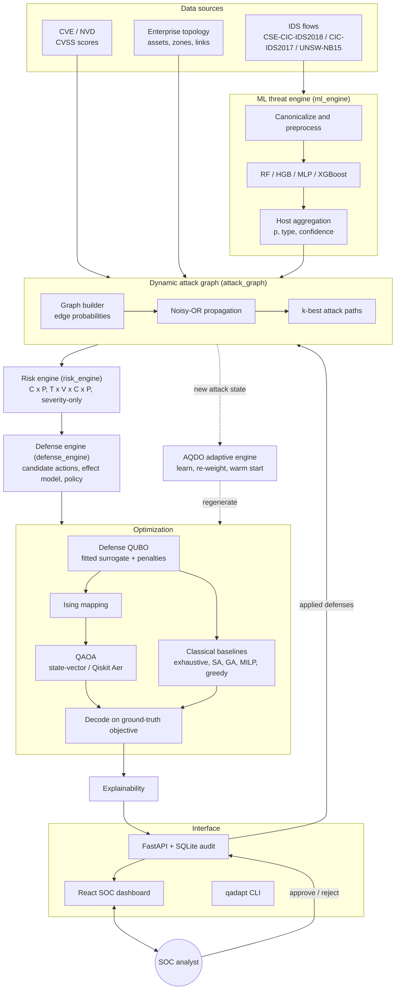
```mermaid
flowchart TB
    subgraph DATA["Data sources"]
        D1[IDS flows<br/>CSE-CIC-IDS2018 / CIC-IDS2017 / UNSW-NB15]
        D2[CVE / NVD<br/>CVSS scores]
        D3[Enterprise topology<br/>assets, zones, links]
    end
    subgraph ML["ML threat engine (ml_engine)"]
        M1[Canonicalize and preprocess] --> M2[RF / HGB / MLP / XGBoost] --> M3[Host aggregation<br/>p, type, confidence]
    end
    subgraph AG["Dynamic attack graph (attack_graph)"]
        G1[Graph builder<br/>edge probabilities] --> G2[Noisy-OR propagation] --> G3[k-best attack paths]
    end
    RISK["Risk engine (risk_engine)<br/>C x P, T x V x C x P, severity-only"]
    DEF["Defense engine (defense_engine)<br/>candidate actions, effect model, policy"]
    subgraph OPT["Optimization"]
        Q1["Defense QUBO<br/>fitted surrogate + penalties"] --> Q2[Ising mapping]
        Q2 --> QA["QAOA<br/>state-vector / Qiskit Aer"]
        Q1 --> CB["Classical baselines<br/>exhaustive, SA, GA, MILP, greedy"]
        QA --> DEC[Decode on ground-truth objective]
        CB --> DEC
    end
    EXP[Explainability]
    subgraph UI["Interface"]
        API[FastAPI + SQLite audit] --> DASH[React SOC dashboard]
        CLI[qadapt CLI]
    end
    AN((SOC analyst))
    AQDO["AQDO adaptive engine<br/>learn, re-weight, warm start"]

    D1 --> ML
    D2 --> AG
    D3 --> AG
    M3 --> AG
    AG --> RISK --> DEF --> OPT
    DEC --> EXP --> API
    DASH <--> AN
    AN -- approve / reject --> API
    API -- applied defenses --> AG
    AG -. new attack state .-> AQDO -. regenerate .-> OPT
```

### 7.2 Hybrid quantum–classical split

| Classical | Quantum |
|---|---|
| ML, preprocessing, attack graph, risk propagation, candidate generation, QUBO fitting, decoding against ground truth, baselines, explanations, API, UI | QAOA circuit evaluation: state preparation with cost and mixer layers, then measurement. Run on a simulator, with a path to IBM hardware |

### 7.3 Request lifecycle (one optimization)

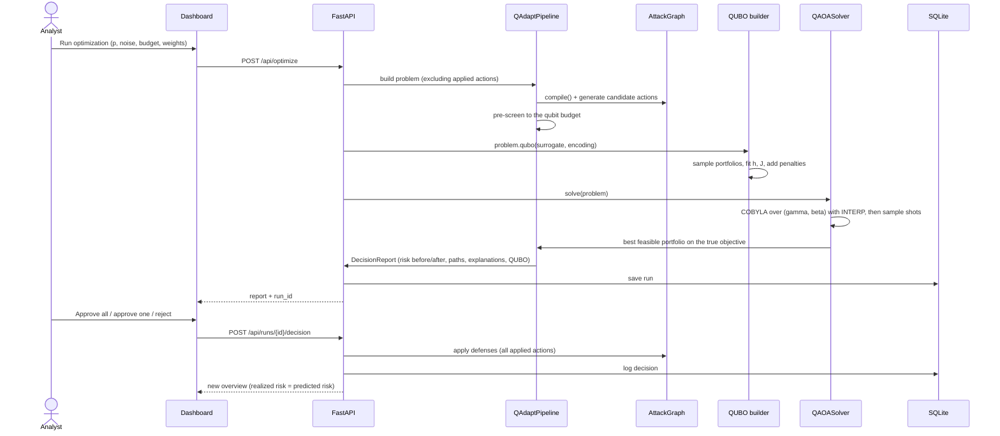
```mermaid
sequenceDiagram
    actor Analyst
    participant UI as Dashboard
    participant API as FastAPI
    participant P as QAdaptPipeline
    participant AG as AttackGraph
    participant Q as QUBO builder
    participant S as QAOASolver
    participant DB as SQLite
    Analyst->>UI: Run optimization (p, noise, budget, weights)
    UI->>API: POST /api/optimize
    API->>P: build problem (excluding applied actions)
    P->>AG: compile() + generate candidate actions
    P->>P: pre-screen to the qubit budget
    API->>Q: problem.qubo(surrogate, encoding)
    Q->>Q: sample portfolios, fit h, J, add penalties
    API->>S: solve(problem)
    S->>S: COBYLA over (gamma, beta) with INTERP, then sample shots
    S->>P: best feasible portfolio on the true objective
    P->>API: DecisionReport (risk before/after, paths, explanations, QUBO)
    API->>DB: save run
    API-->>UI: report + run_id
    Analyst->>UI: Approve all / approve one / reject
    UI->>API: POST /api/runs/{id}/decision
    API->>AG: apply defenses (all applied actions)
    API->>DB: log decision
    API-->>UI: new overview (realized risk = predicted risk)
```

### 7.4 AQDO adaptive loop (state machine)

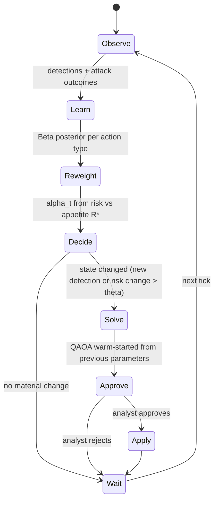
```mermaid
stateDiagram-v2
    [*] --> Observe
    Observe --> Learn: detections + attack outcomes
    Learn --> Reweight: Beta posterior per action type
    Reweight --> Decide: alpha_t from risk vs appetite R*
    Decide --> Solve: state changed (new detection or risk change > theta)
    Decide --> Wait: no material change
    Solve --> Approve: QAOA warm-started from previous parameters
    Approve --> Apply: analyst approves
    Approve --> Wait: analyst rejects
    Apply --> Wait
    Wait --> Observe: next tick
```

### 7.5 Deployment

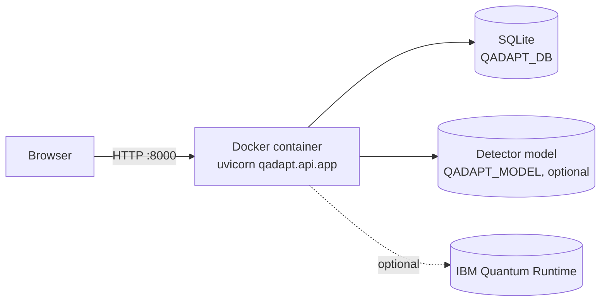
```mermaid
flowchart LR
    B[Browser] -->|HTTP :8000| C["Docker container<br/>uvicorn qadapt.api.app"]
    C --> S[("SQLite<br/>QADAPT_DB")]
    C --> M[("Detector model<br/>QADAPT_MODEL, optional")]
    C -.optional.-> IBM[(IBM Quantum Runtime)]
```

The built dashboard is served by the same FastAPI process (`frontend/dist`), so a
single container provides everything.

---

## 8. Module structure and import graph

### 8.1 Import graph (generated from source)

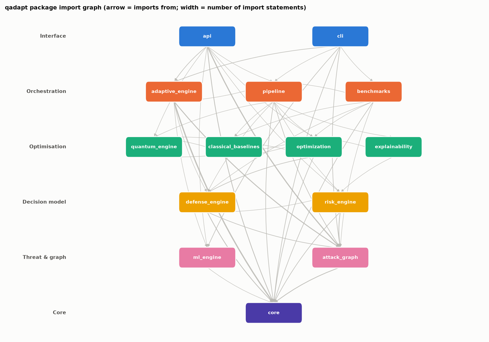

The graph above is computed from the source code itself (`python -m experiments.make_doc_assets`;
the adjacency list is in `figures/import_graph.json`).

* **There are no upward imports between layers**: dependencies always point down
  towards `core`. The tool verifies this.
* `optimization → quantum_engine` and `classical_baselines → quantum_engine` are
  **lazy** imports inside functions. They give access to the QUBO surrogate and do not
  form a load-time cycle.

### 8.2 Package responsibilities

| Package | Key types / functions | Responsibility |
|---|---|---|
| `core` | `Asset`, `Vulnerability`, `ThreatAssessment`, `DefenseAction`, `OptimizationConfig` | shared domain model and validated configuration |
| `ml_engine` | `load_cic_csvs`, `load_unsw_nb15`, `generate_flows`, `train_and_evaluate`, `ThreatDetector` | dataset loading, training, per-host threat assessment |
| `attack_graph` | `Topology`, `AttackGraph`, `CompiledGraph`, `propagate`, `top_attack_paths`, `to_cytoscape` | topology, graph state, risk propagation, paths |
| `risk_engine` | `RiskModel`, `RiskReport`, `downstream_exposure` | three risk models, criticality, threat scoring |
| `defense_engine` | `ActionGenerator`, `DefenseEvaluator`, `build_policy`, `prescreen` | candidate actions, batched effect model, policy |
| `optimization` | `DefenseProblem`, `Solver`, `SolveResult` | ground-truth objective, feasibility, solver interface |
| `quantum_engine` | `build_defense_qubo`, `QUBO`, `qubo_to_ising`, `QAOASolver`, `NOISE_LEVELS` | QUBO, Ising, QAOA, Qiskit backend, noise |
| `classical_baselines` | `Exhaustive`, `ScoreRanking`, `Greedy`, `SimulatedAnnealing`, `Genetic`, `MILP`, `RandomSampling` | comparison solvers |
| `adaptive_engine` | `AttackEnvironment`, `EffectivenessLearner`, `AdaptiveWeights`, `AQDOController`, `run_episode` | AQDO loop and ground-truth simulation |
| `explainability` | `explain` | why selected / why not |
| `pipeline` | `QAdaptPipeline`, `make_solver`, `DecisionReport` | end-to-end orchestration |
| `benchmarks` | `make_instance`, `compare_solvers` | reproducible benchmark instances |
| `api` | FastAPI `app`, `SOCSession`, `Storage` | REST API, session, audit persistence |
| `cli` | `qadapt demo / serve / train / benchmark / episode` | command line |

---

## 9. User flow (SOC analyst journey)

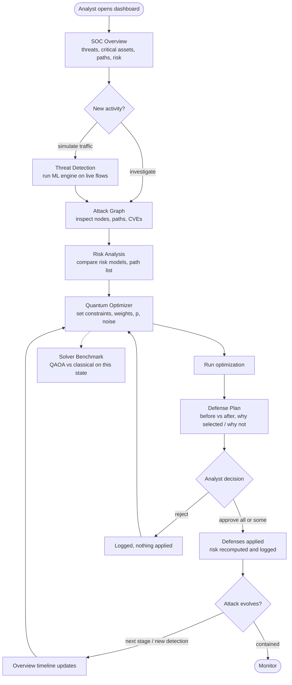
```mermaid
flowchart TD
    A([Analyst opens dashboard]) --> B[SOC Overview<br/>threats, critical assets, paths, risk]
    B --> C{New activity?}
    C -- simulate traffic --> D[Threat Detection<br/>run ML engine on live flows]
    C -- investigate --> E[Attack Graph<br/>inspect nodes, paths, CVEs]
    D --> E
    E --> F[Risk Analysis<br/>compare risk models, path list]
    F --> G[Quantum Optimizer<br/>set constraints, weights, p, noise]
    G --> H[Run optimization]
    H --> I[Defense Plan<br/>before vs after, why selected / why not]
    I --> J{Analyst decision}
    J -- approve all or some --> K[Defenses applied<br/>risk recomputed and logged]
    J -- reject --> L[Logged, nothing applied]
    K --> M{Attack evolves?}
    L --> G
    M -- next stage / new detection --> N[Overview timeline updates]
    N --> G
    M -- contained --> O([Monitor])
    G -.-> P[Solver Benchmark<br/>QAOA vs classical on this state]
```

**Typical session** (shown in §13):

1. Start on the overview: risk is 77%, with an attack detected on the web server.
2. Run ML detection on simulated live traffic.
3. Inspect the attack graph and risk register.
4. Run the quantum optimizer.
5. Review the explained plan and approve it. Risk drops to about 29%.
6. Advance the attack to stage T2. Risk rises again, and the analyst re-optimizes.

---

## 10. Algorithms and mathematical model

The full derivations are in [METHODOLOGY.md](METHODOLOGY.md). This section summarizes
them.

### 10.1 Threat assessment

For each flow *f*, maliciousness is `m_f = 1 − P(BENIGN | f)`. For a host *h*:

```
p_h = mean(top-5 m_f) · (1 − exp(−n_flagged / 3))
```

The second factor is an evidence term: one suspicious flow cannot saturate the score.

### 10.2 Attack graph and risk propagation

Each edge probability `p_uv` comes from the link kind (network, credential, lateral,
phishing) and the CVSS-derived exploitability of *v*. Compromise probability is the
least fixed point of

```
P(attacker) = A        (attacker-activity prior, raised by detections)
P(v) = 1 − (1 − t_v m_v) · Π_(u,v)∈E (1 − P(u) · p_uv · m_uv)
```

Network risk is `R = Σ C_v P(v) / Σ C_v`. Propagation is batched through a sparse
incidence matrix, so thousands of candidate plans are scored per call.

### 10.3 Effect model and ground-truth objective

```
m_e(x) = exp(x · L_e),   L_ie = log(1 − η_i φ_ie)
J(x)   = α R(x)/R(0) + β cᵀx + γ τᵀx + δ dᵀx
         s.t. budget, time, disruption, cardinality, conflicts, prerequisites, forbidden, mandatory
```

### 10.4 Defense QUBO

```
Q(x) = α(1 + hᵀx + xᵀJx) + βcᵀx + γτᵀx + δdᵀx + P·policy(x) + P·(−λ₁ĥ + λ₂ĥ²)
```

* The surrogate (h, J) is fitted by ridge regression on sampled portfolios.
* The penalty P is set automatically to twice the largest single-bit-flip swing, so no
  single flip into infeasibility can pay off.

### 10.5 QAOA

* The QUBO is mapped to an Ising Hamiltonian with `x = (1 − z)/2`.
* The ansatz is `|ψ(γ,β)⟩ = Π_l e^{−iβ_l ΣX} e^{−iγ_l H_C} |+⟩^{⊗n}`.
* Optimization uses COBYLA with restarts and INTERP initialization for depth p > 1.
  CVaR-α scoring is optional.
* Samples are decoded to the best **feasible** plan on J(x).
* Noise is modelled two ways:
  * a global depolarizing channel plus readout flips in the state-vector engine
  * gate-level Aer noise models in the Qiskit backend

### 10.6 AQDO pseudo-code

```text
input: topology, config, solver, approval policy
loop each tick t:
    observations, outcomes ← environment / ML engine
    graph.apply_threats(observations); mark high-confidence hosts compromised
    for each attempt on a defended edge that would have succeeded undefended:
        Beta[action_type] += (blocked, not blocked)
    graph.apply_defenses(applied, effectiveness = posterior means)
    R_t ← network risk
    if new detection or |R_t − R_last| > θ:
        α_t ← α₀ · min(1 + κ · max(0, R_t − R*)/R*, α_max)
        candidates ← generate(graph) \ applied;  pre-screen to the qubit budget
        Q ← fit QUBO on the current state;  x ← QAOA(Q, warm start = θ_prev)
        approved ← analyst(x);  applied += approved
```

---

## 11. Data, datasets and data model

### 11.1 Datasets

| Dataset | Role | Notes |
|---|---|---|
| CSE-CIC-IDS2018 | primary ML training | 23 canonical CICFlowMeter features, unified labels |
| CIC-IDS2017 | cross-dataset validation | column spellings mapped to the same schema |
| UNSW-NB15 | third validation set | separate numeric feature space |
| NVD / CVE | vulnerability scores | built-in catalog of 14 well-known CVEs plus an NVD API 2.0 parser |
| Synthetic flows | tests, CI, demo | **labelled as synthetic**; not for publication |
| Synthetic enterprises | decision layer | demo network (14 assets) and generated 10–500-node networks |

The public datasets contain **no topology, asset criticality or defense metadata**.
Real data therefore drives the ML layer, and controlled synthetic enterprises drive the
decision layer (see [DATASETS.md](DATASETS.md)).

**Unified attack taxonomy:** BENIGN, DOS, DDOS, BRUTE_FORCE, WEB_ATTACK, BOTNET,
INFILTRATION, RECON, EXPLOIT.

### 11.2 Defense action catalog

| Action | Effect on the graph | Cost | Time | Base disruption | Nominal effectiveness |
|---|---|---|---|---|---|
| Isolate host | cuts all in- and out-edges | 0.15 | 0.10 | 0.55 | 0.95 |
| Block IP | cuts attacker → entry edges | 0.05 | 0.02 | 0.02 | 0.70 |
| Revoke credentials | cuts credential edges, halves lateral edges | 0.10 | 0.08 | 0.20 | 0.90 |
| Disable account | cuts credential and lateral edges from a workstation | 0.05 | 0.03 | 0.10 | 0.70 |
| Patch vulnerability | cuts incoming network edges | 0.25 | 0.60 | 0.15 | 0.85 |
| Segment network | cuts edges across a zone boundary | 0.35 | 0.40 | 0.35 | 0.85 |
| Increase monitoring | weakens incoming edges and local evidence | 0.05 | 0.05 | 0.00 | 0.25 |
| Protect database | cuts incoming credential edges | 0.20 | 0.20 | 0.10 | 0.80 |
| Block port | cuts incoming network edges to a server | 0.05 | 0.05 | 0.20 | 0.60 |
| Quarantine endpoint | cleans the node, cuts out-edges | 0.10 | 0.15 | 0.10 | 0.90 |

Disruption is scaled by the target's criticality and user count. All values are
normalized to [0, 1].

### 11.3 Persistence schema

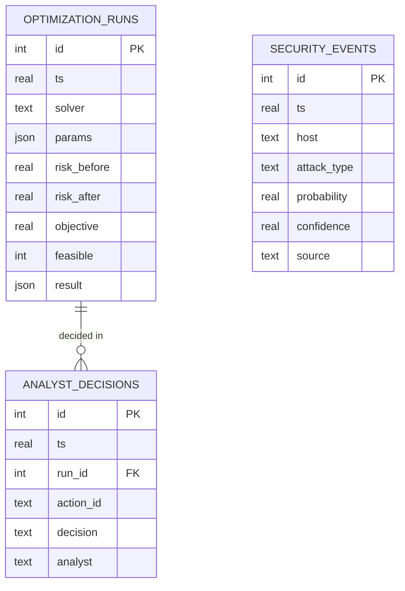
```mermaid
erDiagram
    OPTIMIZATION_RUNS ||--o{ ANALYST_DECISIONS : "decided in"
    OPTIMIZATION_RUNS {
        int id PK
        real ts
        text solver
        json params
        real risk_before
        real risk_after
        real objective
        int feasible
        json result
    }
    ANALYST_DECISIONS {
        int id PK
        real ts
        int run_id FK
        text action_id
        text decision
        text analyst
    }
    SECURITY_EVENTS {
        int id PK
        real ts
        text host
        text attack_type
        real probability
        real confidence
        text source
    }
```

---

## 12. API reference

Interactive OpenAPI docs are served at `/docs` when the server runs.

| Method | Endpoint | Purpose | Notes |
|---|---|---|---|
| GET | `/api/health` | version, Qiskit availability, solvers | |
| POST | `/api/session/reset` | load scenario `demo` / `small` / `medium` / `large` | optionally without initial threats |
| GET | `/api/overview` | KPIs, timeline, applied defenses, staged scenario | |
| GET | `/api/threats` | active threat assessments | |
| POST | `/api/threats` | inject a threat manually | 404 for unknown asset; 422 for invalid probability |
| POST | `/api/threats/detect` | run the ML engine on simulated live flows | trains or loads the detector on first use |
| GET | `/api/graph` | Cytoscape elements: risk, CVEs, defended edges, top path | |
| GET | `/api/risk?model=` | risk report + attack paths | `propagation`, `multiplicative`, `severity_only` |
| POST | `/api/optimize` | build the QUBO, solve, explain; stores a pending run | 400 if the simulator's qubit limit is exceeded |
| POST | `/api/compare` | every requested solver on the same instance | per-solver `errors`; `gap_to_best` |
| GET | `/api/runs`, `/api/runs/{id}` | run history with analyst decisions | |
| POST | `/api/runs/{id}/decision` | approve or reject all, or a subset | an empty list is rejected (400); stale run gives 409 |
| POST | `/api/adaptive/next-stage` | advance the scripted attack (demo only) | 409 when complete |
| GET | `/api/audit` | security events and decisions | |

Example:

```bash
curl -X POST localhost:8000/api/optimize -H 'content-type: application/json' \
  -d '{"solver":"qaoa","p":2,"noise":"ideal","budget":0.5,"max_qubits":12}'
```

---

## 13. Demo walkthrough with screenshots

All screenshots below were captured automatically from the running application
(`python -m experiments.make_doc_assets`).

### 13.1 SOC overview

KPIs, the adaptive risk timeline, the staged attack scenario and applied defenses. At
session start an attack is detected on the web server and network risk is 77%.

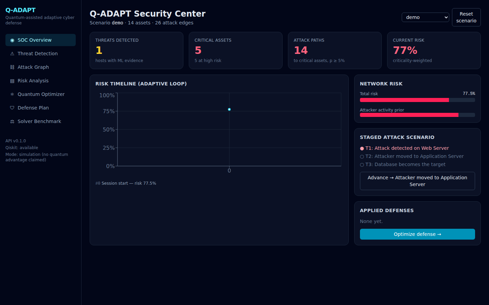

### 13.2 Threat detection

Simulated live traffic towards **FS-01** is classified by the ML engine. The file server
is flagged as an INFILTRATION threat (84% probability), and low-severity anomalies on
other hosts show that the detector produces false positives.

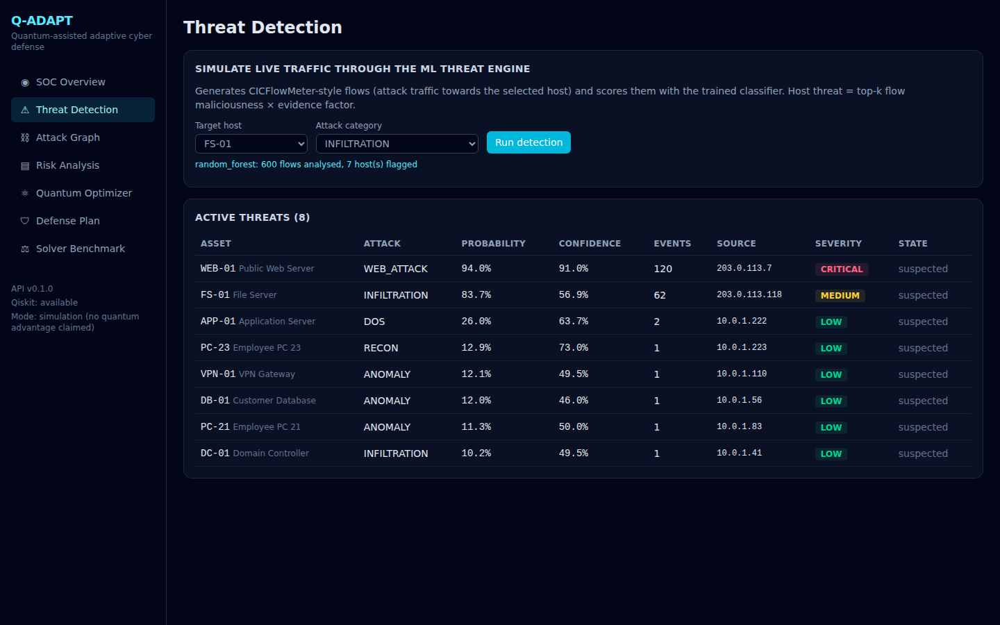

### 13.3 Attack graph

The interactive graph, colored by compromise probability. The most likely path is shown
in red: ATTACKER → WEB-01 → APP-01 → DB-01. Selecting APP-01 shows its criticality, ML
evidence, compromise probability, risk and CVEs.

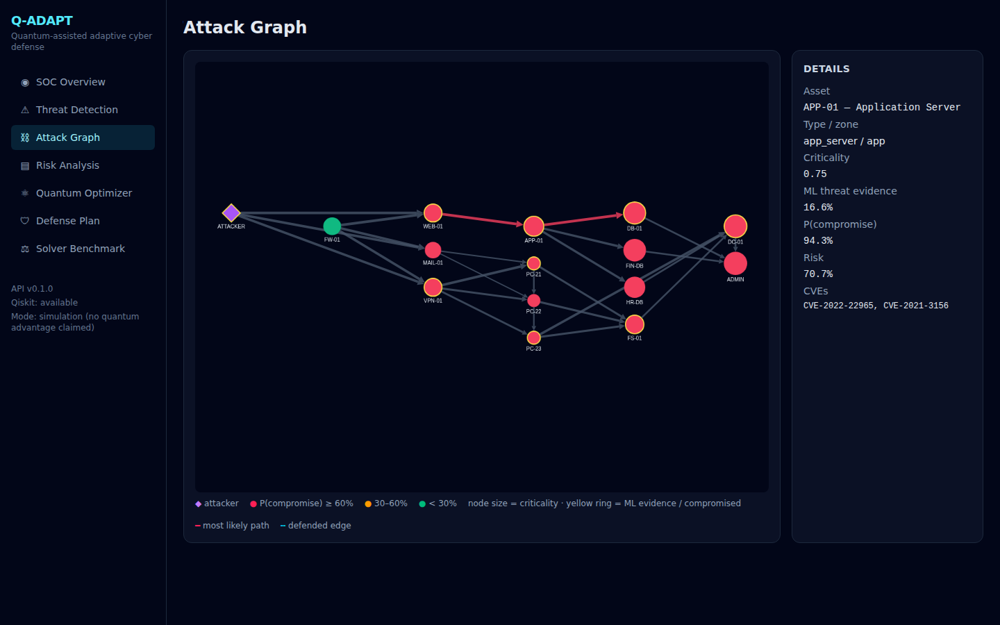

### 13.4 Risk analysis

The asset risk register, a risk bar chart, and the most likely attack paths to critical
assets. Three risk models can be selected.

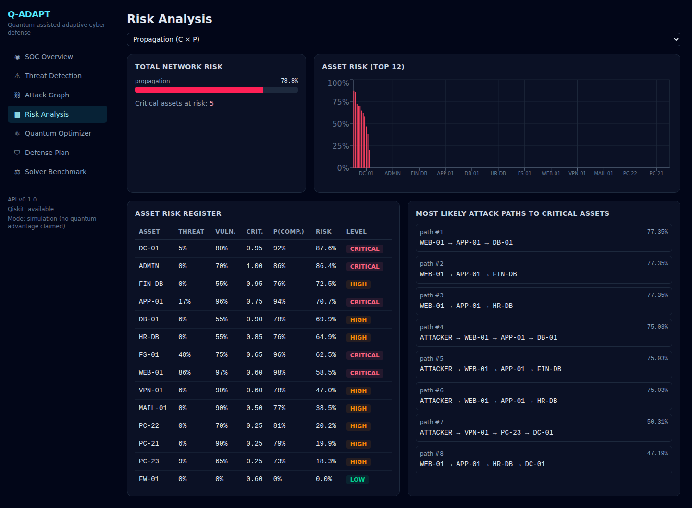

### 13.5 Quantum optimizer

Problem and solver settings, then the results: binary variables, objective, circuit
depth, approximation ratio, P(optimal state) with its amplification, surrogate fidelity,
the **QUBO matrix heat map** and the **QAOA convergence curve**.

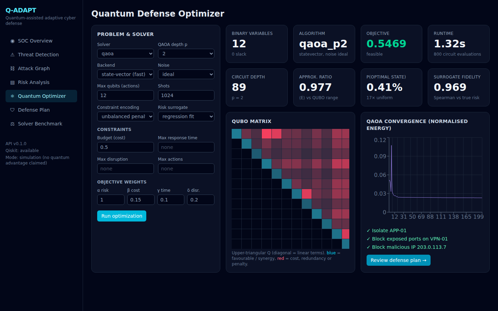

### 13.6 Defense plan (explainable, human-in-the-loop)

Risk before and after; risk reduction, attack paths, cost and business impact. **Why
selected** and **why not** for each action, with per-action approve and reject buttons.

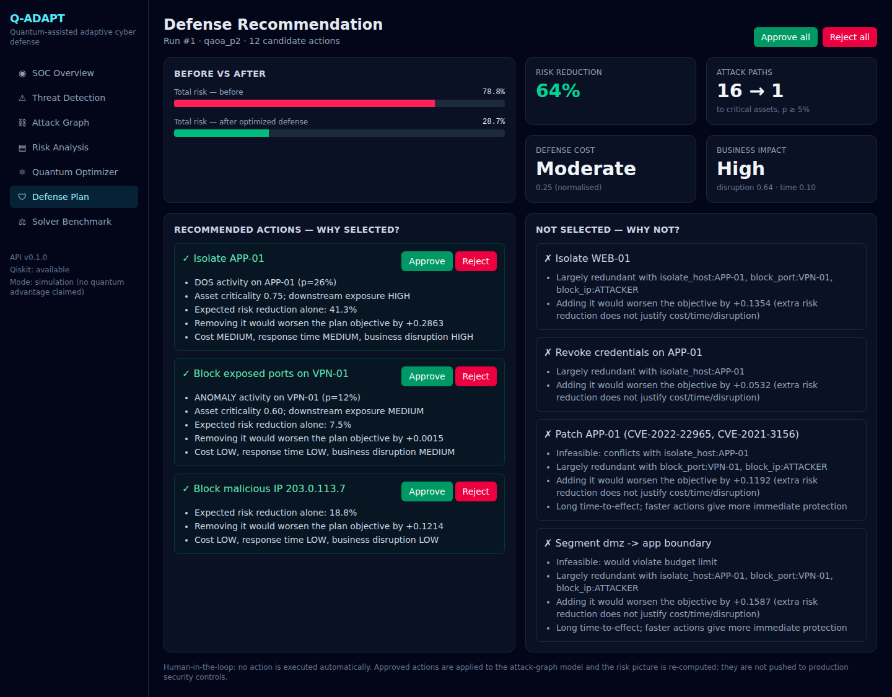

### 13.7 After approval, then the attack moves (T2)

The timeline shows the approved plan cutting risk from about 79% to 29%. When the
attacker then moves to the application server, risk rises to 37% and the analyst
re-optimizes.

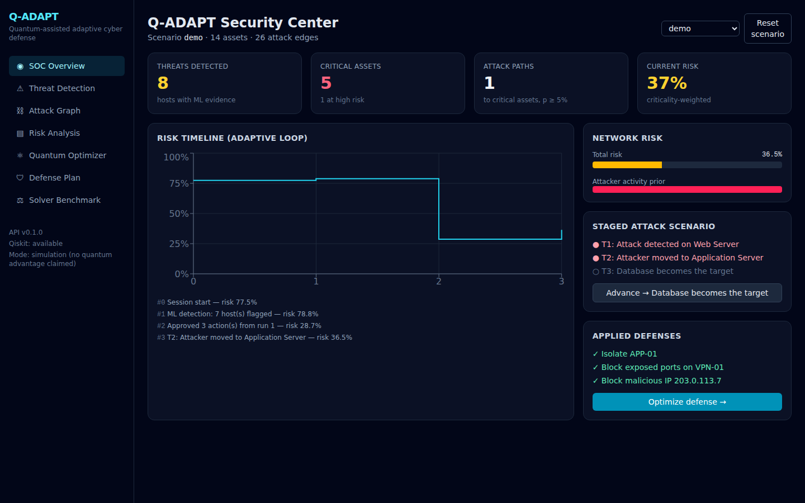

### 13.8 Solver benchmark

QAOA against every classical baseline on the current threat state, scored on the same
ground-truth objective.

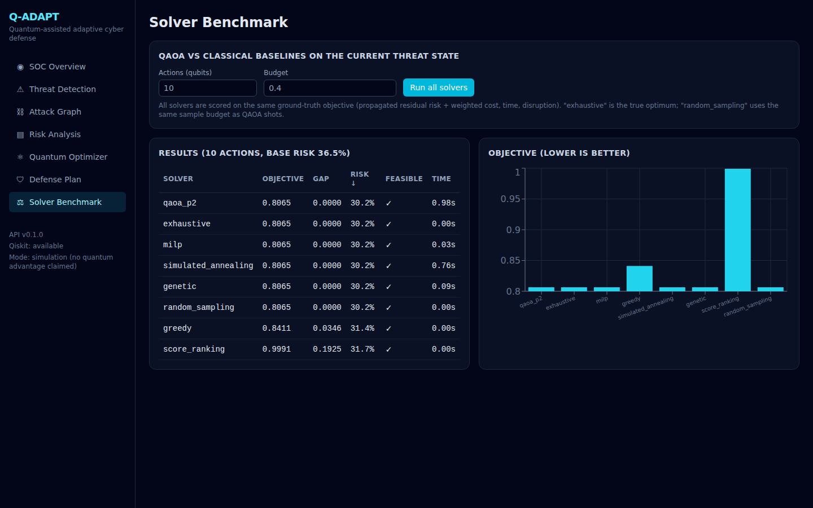

### 13.9 Command-line demo

```text
$ qadapt demo
================================================================
 Q-ADAPT defense recommendation
================================================================
 solver          : qaoa_p2   (1.4s, feasible=True)
 qubits / depth  : 12 / 89   approx. ratio 0.976
 risk            : 79.5% -> 34.8%   (-56.2%)
 attack paths    : 19 -> 14
 cost/time/disr. : 0.15 / 0.10 / 0.19
----------------------------------------------------------------
 [+] Revoke credentials on APP-01
       - EXPLOIT activity on APP-01 (p=91%)
       - Asset criticality 0.75; downstream exposure HIGH
       - Expected risk reduction alone: 32.5%
 [+] Block malicious IP 203.0.113.7
 [ ] Isolate APP-01
       - Largely redundant with revoke_credentials:APP-01
```

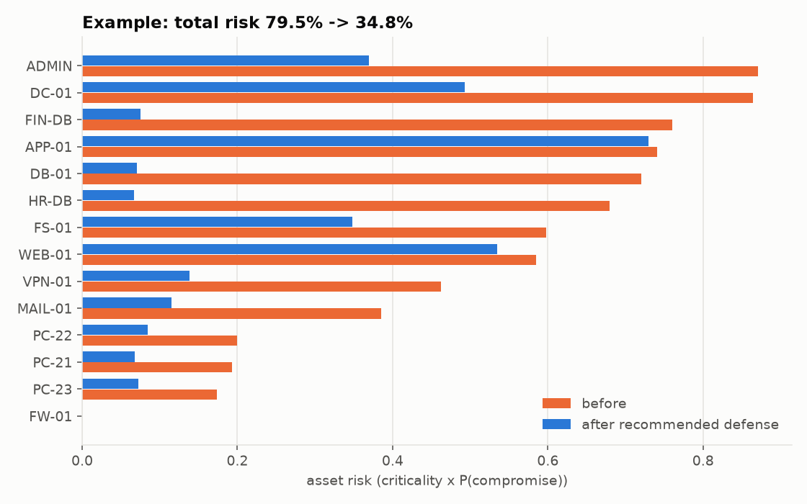

---

## 14. Results

The full tables and every figure are in [RESULTS_REPORT.md](RESULTS_REPORT.md), with
raw data in [`../results/`](../results/). The settings were fixed seeds; 10–20 seeds per
configuration; 95% confidence intervals; paired Wilcoxon tests.

### 14.1 ML threat detection

> These scores use **synthetic flows**: they validate the pipeline and are not
> dataset results.

| Model | Train accuracy | Test accuracy | Macro F1 | ROC-AUC | FPR | FNR |
|---|---|---|---|---|---|---|
| Random Forest | 1.000 | 0.889 | 0.783 | 0.971 | 0.006 | 0.296 |
| **Gradient Boosting** | 1.000 | **0.940** | **0.902** | **0.981** | 0.020 | 0.122 |
| MLP | 0.942 | 0.889 | 0.830 | 0.954 | 0.072 | 0.151 |

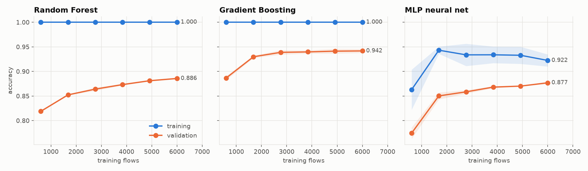

| | |
|---|---|
| 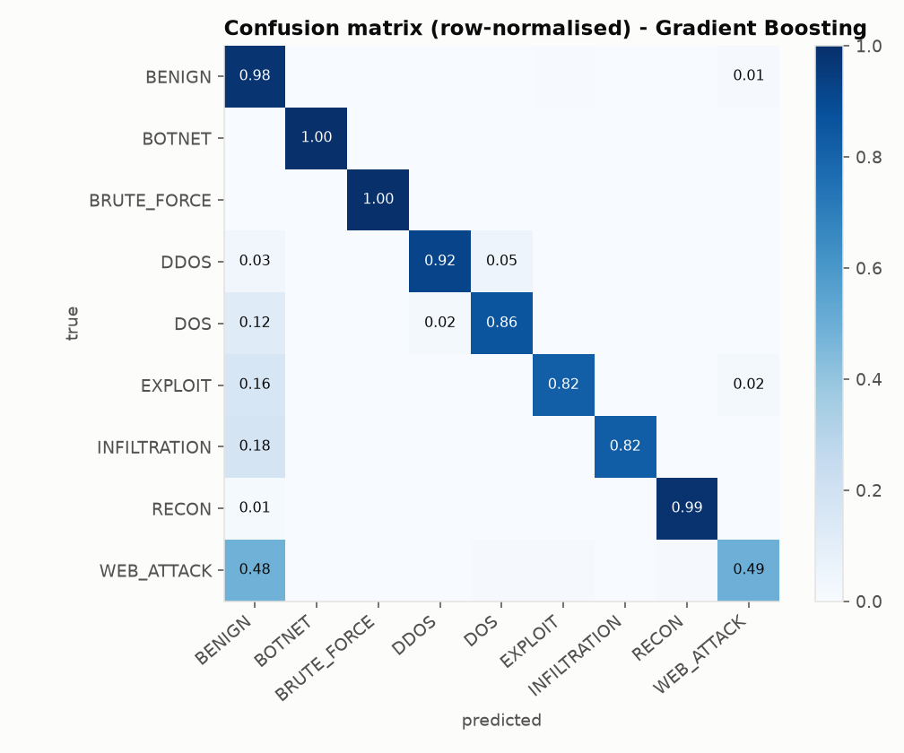 | 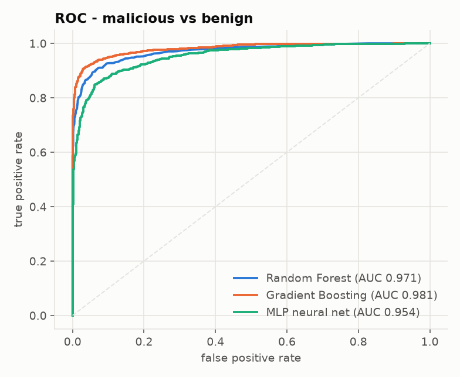 |
| 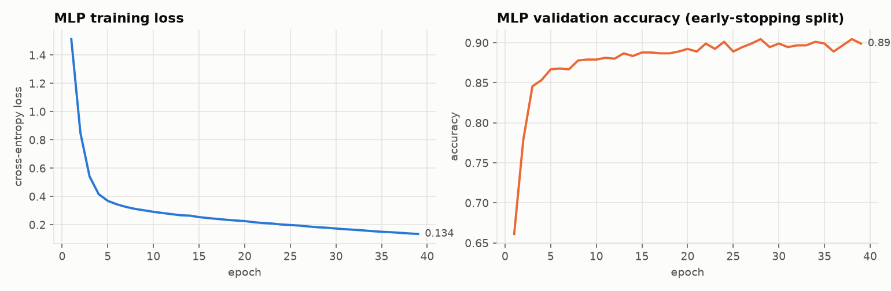 | 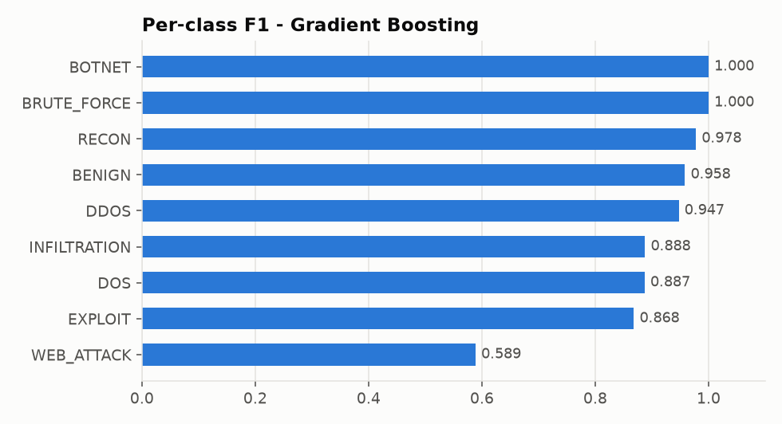 |

The weakest class is WEB_ATTACK (F1 0.59): about half of web attacks are classified as
benign, because flow-level features miss payload content.

### 14.2 Attack-graph scalability (Experiment 2)

| Nodes | Edges | Build | Propagation | Batched scoring / plan | Path analysis |
|---|---|---|---|---|---|
| 51 | 183 | 2.8 ms | 2.0 ms | 0.09 ms | 2.6 ms |
| 251 | 3,442 | 35 ms | 1.2 ms | 0.75 ms | 102 ms |
| 501 | 13,268 | 127 ms | 1.9 ms | 4.1 ms | 583 ms |

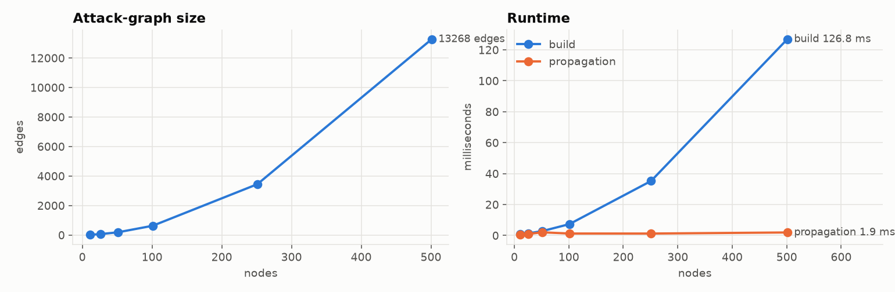

### 14.3 QAOA against classical optimizers (Experiments 3 and 4)

50 instances (sizes 6–14 actions, 10 seeds each); the gap is measured to the exhaustive
optimum.

| | |
|---|---|
| 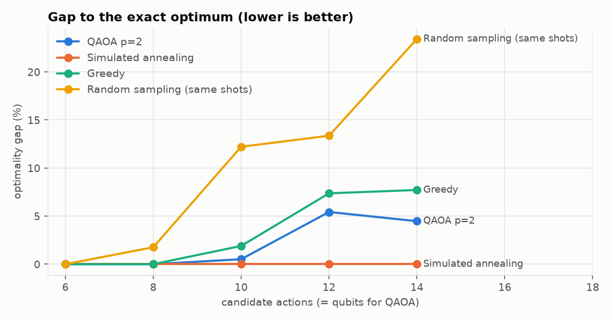 | 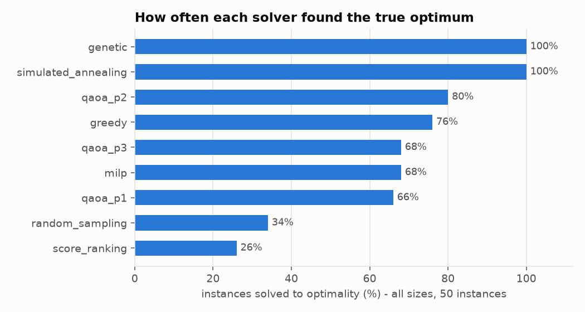 |

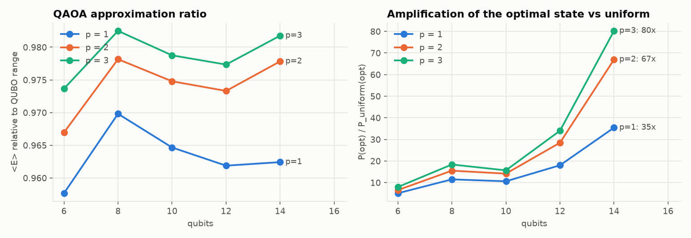

* QAOA p = 2 found the optimum on 100% of instances at n = 6–8, 90% at 10, 60% at 12
  and 50% at 14. Its mean gap at 12–14 actions is about 5%.
* **Simulated annealing and the genetic algorithm were optimal on every instance.**
  They beat QAOA p = 2 significantly (p = 0.019).
* QAOA p = 2 beats naive score ranking (p = 1.5e-7) and equal-budget random sampling
  (p = 3.6e-6). It ties statistically with greedy and MILP.
* The approximation ratio rises with depth (0.96 → 0.98). The optimal state is amplified
  5–80× over uniform sampling.

### 14.4 Quantum noise (Experiment 5)

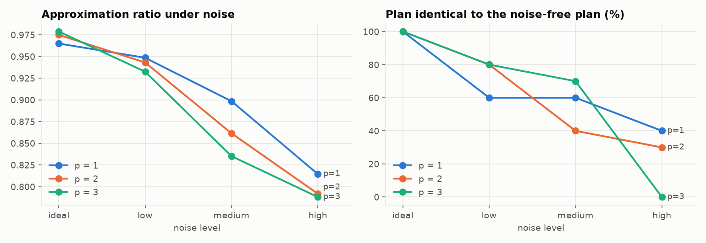

The approximation ratio falls from about 0.97 (ideal) to about 0.79 at high noise. Under
high noise the recommended plan matched the ideal plan in only 30–40% of runs, and 0% at
p = 3: deeper circuits are more fragile.

### 14.5 Dynamic adaptation (Experiment 6)

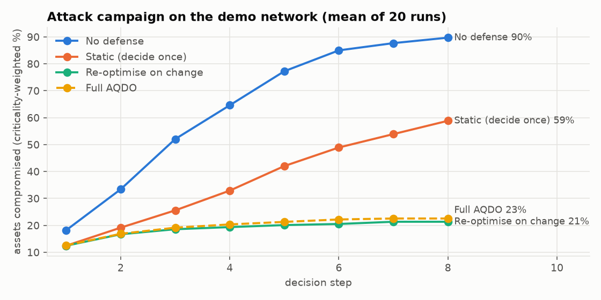

| Network | No defense | Static | Re-optimize | Full AQDO |
|---|---|---|---|---|
| Demo (14 nodes), cumulative loss | 5.08 | 2.98 | **1.50** | 1.52 |
| Enterprise-40, cumulative loss | 0.76 | 0.51 | **0.16** | **0.16** |
| Critical assets lost (demo) | 4.65 | 2.05 | **0.00** | **0.00** |

Re-optimization against a static plan: p = 1.9e-6 (demo) and p = 0.001 (enterprise).
Full AQDO against re-optimization: **no significant difference**.

**Scripted staged attack** (QAOA p = 1): the plan changes at each stage, and defenses
already in force are never re-recommended.

| Stage | Event | Risk before → after | Recommended |
|---|---|---|---|
| T1 | attack on web server | 0.775 → 0.249 | Isolate WEB-01, block malicious IP |
| T2 | attacker on application server | 0.599 → 0.246 | Revoke credentials and increase monitoring on APP-01, isolate DC-01 |
| T3 | database targeted | 0.376 → 0.297 | Revoke credentials and increase monitoring on DB-01, monitor WEB-01 |

### 14.6 Constraints and encodings (Experiment 7)

| Encoding | Extra qubits | QUBO minimizer feasible | Plan feasible after decoding |
|---|---|---|---|
| Unbalanced (default) | 0 | **100%** | 100% |
| Slack | +4 per constraint | 50–75% | 100% |

### 14.7 Ablation (Experiment 8)

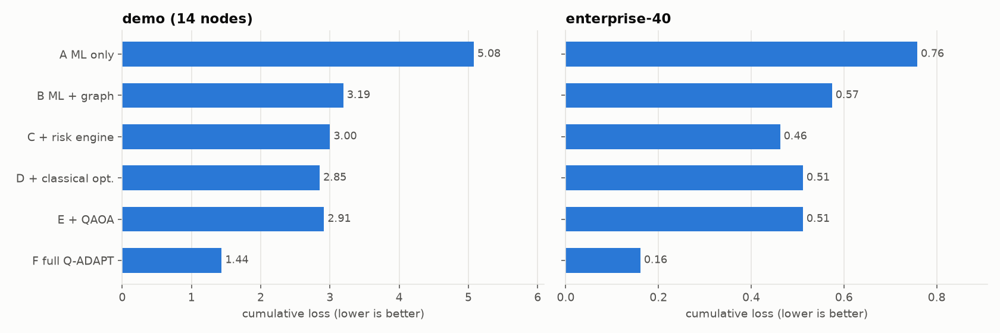

| Step | Effect on cumulative loss |
|---|---|
| A ML only → B + attack graph | **−1.88 (p = 0.0003)** demo; −0.18 (p = 0.04) enterprise |
| B → C + risk engine | −0.19 / −0.11 (not significant) |
| C → D + classical optimizer | not significant |
| D → E + QAOA | not significant (same plans) |
| E → F + adaptation (AQDO) | **−1.48 (p = 1.9e-6)** demo; −0.35 (p = 0.001) enterprise |

### 14.8 Conclusions

1. **The decision-engine formulation delivers the value**: graph-aware risk, the fitted
   QUBO and adaptive re-optimization.
2. **QAOA is viable but not superior.** It respects constraints and is near-optimal on
   small instances, but good classical heuristics are better, as expected on today's
   hardware.
3. **Noise is a real risk** for quantum recommendations, especially with deeper
   circuits.
4. **Adaptation is the largest single lever.** The learning and re-weighting components
   need longer campaigns or stronger mis-specification to show value.

---

## 15. Testing and quality assurance

| Suite | Count | Scope |
|---|---|---|
| `tests/unit` | 226 | every module, including edge cases: zero, single and huge action sets; zero or negative limits; infeasible policies; qubit limits; NaN/inf data; real-format CSVs; persistence |
| `tests/property` | 9 properties × 40 random cases | Hypothesis invariants: Ising equivalence, normalized QAOA state, propagation bounds and monotonicity, risk monotonicity, solver ≥ optimum, batch consistency |
| `tests/integration` | 92 | ML → defense chain, all solvers, risk models and policies, API workflows, CLI, persistence |
| `tests/e2e` | 5 | Playwright drives the real dashboard: every screen, detection, optimize → approve → adapt, benchmark, with no console errors |

Overall: **332 tests (331 pass; the XGBoost test skips when XGBoost isn't installed), 99%
line coverage**, a 90% coverage gate in CI, and Ruff lint. CI runs Python 3.10 and 3.12, the frontend build and e2e.

**Bugs found and fixed by the test campaign:**

* An empty approval list approved every action (a human-in-the-loop bypass).
* NaN values broke JSON responses.
* Qubit-limit errors returned HTTP 500.
* Negative limits were accepted.
* Problems with zero actions crashed four solvers.
* A budget of 0 caused a 10¹⁶ coefficient blow-up in the QUBO.
* Already-applied defenses were re-recommended.
* A batch-shape bug affected the severity-only risk model.
* The CLI benchmark depended on files outside the package.

---

## 16. Patent and IP considerations

> **Disclaimer.** This section identifies *candidate* technical mechanisms for an IP
> discussion. It is **not** a patentability opinion. The generic combination "attack
> graph + QUBO + QAOA for cyber defense" has prior art (the project proposal cites a
> 2026 US patent application on quantum-powered cyber defense, and published work on
> quantum attack-graph analytics). A professional prior-art search and a patent
> attorney review are required before any filing.

**What should not be claimed** (too broad or anticipated): using QAOA in cybersecurity;
using attack graphs for risk; a QUBO for selecting countermeasures; ML-based intrusion
detection.

**Candidate claim directions** (specific mechanisms implemented and evaluated here):

1. **Ground-truth-fitted defense QUBO.** Generate the QUBO's linear and quadratic
   coefficients by regression of the propagated network risk over sampled defense
   portfolios, so action interactions (redundancy and synergy) are derived from the
   graph rather than specified by hand. Fidelity is reported per QUBO, and solutions are
   decoded against the non-surrogate objective.
2. **Adaptive QUBO regeneration loop (AQDO).** On a change of security state:
   * update action-effectiveness posteriors from edge-level attack outcomes
   * re-derive the defended graph from base state using those posteriors
   * scale the security weight by risk relative to an organizational risk appetite
   * regenerate candidates, excluding applied defenses, then the QUBO
   * warm-start the quantum optimizer from the previous variational parameters
3. **Predicted-equals-realized defense application.** A shared effect model applies
   approved actions to the attack graph exactly as the optimizer evaluated them, so the
   post-approval risk equals the predicted residual risk. This yields an auditable
   recommendation record with analyst decisions.
4. **Qubit-budget-aware candidate pre-screening.** Before QUBO construction, rank
   actions by marginal risk reduction per unit of operational burden to fit hardware or
   simulator limits.

A possible **system claim** combines (1)–(3) into a pipeline: ML-derived host evidence,
then the probabilistic attack graph, then the fitted QUBO with zero-slack constraint
encoding, then the quantum or classical solver, then explanation, then human approval,
then exact application, then regeneration.

**Evidence to support novelty and utility:** the reported surrogate fidelity (§14.3)
and adaptation results (§14.5). Note that Experiments 6 and 8 found **no significant
benefit from the learning and re-weighting sub-mechanisms**, which weakens claims that
rely on their utility.

---

## 17. Limitations and threats to validity

| Threat | Description | Mitigation / status |
|---|---|---|
| Synthetic data | ML scores use synthetic flows; enterprises are generated | real-dataset loaders implemented; Experiment 1 still to run on the public data |
| Model assumptions | edge probabilities and action costs are assumptions calibrated to CVSS | documented; calibration with EPSS / incident data is future work |
| Simulation only | QAOA is classically simulated, limited to about 20 qubits | no speed-up claimed; Qiskit path to hardware exists |
| Noise model | global-depolarizing approximation | gate-level Aer check provided |
| Small instances | ≤ 14 actions for exact comparisons | pre-screening for larger graphs; decomposition is future work |
| Surrogate | quadratic, so higher-order interactions are only fitted | fidelity reported; decoding uses the true objective |
| Environment | the stochastic attacker model is simplified | multiple seeds and two topologies; same seeds across policies |
| Detector noise | the synthetic detector produces low-severity false positives | shown in the demo; analysts approve every action |

---

## 18. Future work

1. Run Experiment 1 on CSE-CIC-IDS2018 / CIC-IDS2017 / UNSW-NB15, including the
   cross-dataset protocol.
2. Run p = 1 instances of up to 10 qubits on IBM Quantum hardware via a runtime sampler
   (a status check, not an advantage claim).
3. Decompose large graphs by attack-path clusters; compare against MILP at 50–200
   actions.
4. Test longer campaigns and stronger mis-specification to see whether learning and
   re-weighting add value.
5. Calibrate edge probabilities with EPSS and incident timelines.
6. Use payload-aware features to fix WEB_ATTACK recall.
7. Write the paper ([paper/OUTLINE.md](../paper/OUTLINE.md)) and obtain a professional
   prior-art search.

---

## 19. Installation, usage and deployment

```bash
git clone https://github.com/Usha-125/Q-ADAPT && cd Q-ADAPT
pip install -e ".[quantum,api,dev,report]"         # Python 3.10+

qadapt demo                                         # one explained decision (QAOA p=2)
qadapt demo --solver milp --scenario medium --json
qadapt train --csv data/raw/cse-cic-ids2018/*.csv   # train the real detector
qadapt episode --policy aqdo --steps 8              # adaptive campaign
qadapt benchmark --sizes 6 8 10 --seeds 3           # QAOA vs classical

cd frontend && npm install && npm run build && cd ..
qadapt serve                                        # http://127.0.0.1:8000 (API docs: /docs)

docker build -t qadapt . && docker run -p 8000:8000 qadapt
```

Environment variables:

| Variable | Meaning |
|---|---|
| `QADAPT_DB` | SQLite path for persistence (default: in-memory) |
| `QADAPT_MODEL` | path to a detector saved by `qadapt train` |

---

## 20. Reproducibility

| Artifact | Command |
|---|---|
| All experiments (about 10 min) | `python -m experiments.run_all` (`--quick` for a smoke run) |
| Results report and 15 figures | `python -m experiments.make_report` |
| Import graph and screenshots | `python -m experiments.make_doc_assets` |
| Tests and coverage | `pytest --cov=qadapt` (browser: `pytest tests/e2e`) |

All randomness is seeded (topologies, threats, data splits, solvers, QAOA, attacker
simulation).

---

## 21. Repository layout

```
qadapt/                 Python package (core, ml_engine, attack_graph, risk_engine, defense_engine,
                        optimization, quantum_engine, classical_baselines, adaptive_engine,
                        explainability, api, pipeline.py, benchmarks.py, cli.py)
frontend/               React + TypeScript SOC dashboard
experiments/            Experiments 1-8, run_all, make_report, make_doc_assets
results/                experiment outputs (JSON + Markdown)
docs/                   this document, METHODOLOGY, ARCHITECTURE, DATASETS, RESULTS_REPORT, ROADMAP,
                        figures/, screenshots/
tests/                  unit/, integration/, property/, e2e/
paper/                  paper outline
Dockerfile, pyproject.toml, .github/workflows/ci.yml
```

---

## 22. References

1. NIST CSRC: *Security Risk Analysis of Enterprise Networks Using Probabilistic Attack
   Graphs* (NIST IR 7788) and the "Measuring Security Risk in Enterprise Networks"
   project.
2. E. Farhi, J. Goldstone, S. Gutmann: *A Quantum Approximate Optimization Algorithm*,
   arXiv:1411.4028 (2014).
3. L. Zhou et al.: *Quantum Approximate Optimization Algorithm: Performance, Mechanism,
   and Implementation on Near-Term Devices*, Phys. Rev. X 10, 021067 (2020). The INTERP
   initialization.
4. P. Kl. Barkoutsos et al.: *Improving Variational Quantum Optimization using CVaR*,
   Quantum 4, 256 (2020).
5. J. A. Montañez-Barrera et al.: *Unbalanced penalization: a new approach to encode
   inequality constraints of combinatorial problems for quantum optimization
   algorithms*, arXiv:2211.13914 (2022).
6. I. Sharafaldin, A. H. Lashkari, A. A. Ghorbani: *Toward Generating a New Intrusion
   Detection Dataset and Intrusion Traffic Characterization* (CIC-IDS2017), ICISSP 2018.
   Also CSE-CIC-IDS2018 (CIC / UNB).
7. N. Moustafa, J. Slay: *UNSW-NB15: a comprehensive data set for network intrusion
   detection systems*, MilCIS 2015.
8. NVD CVE API 2.0, National Vulnerability Database.
9. Qiskit and Qiskit Aer documentation (IBM Quantum).
10. The project proposal's cited prior art: a 2026 US patent application on
    quantum-powered cyber defense, and *Adaptive quantum-walk-inspired attack graph
    compiler…* (Scientific Reports, 2026).

---

## 23. Glossary

| Term | Meaning |
|---|---|
| **AQDO** | Adaptive Quantum Defense Optimization: Q-ADAPT's feedback loop |
| **Attack graph** | a directed graph of how an attacker can move between assets, with a success probability per step |
| **Approximation ratio** | `(E_max − ⟨E⟩)/(E_max − E_min)`; 1 means QAOA's average equals the optimum |
| **CVaR-α** | conditional value-at-risk: the average of the best α fraction of samples |
| **Defense portfolio** | a set of selected defensive actions (a binary vector x) |
| **INTERP** | initializing depth-(p+1) QAOA parameters by interpolating the optimal depth-p ones |
| **Ising** | a spin formulation of a QUBO (z = ±1), used to build quantum circuits |
| **Noisy-OR** | a probability that at least one of several independent causes succeeds |
| **QAOA** | Quantum Approximate Optimization Algorithm, a variational quantum algorithm for combinatorial problems |
| **QUBO** | Quadratic Unconstrained Binary Optimization: minimize xᵀQx over binary x |
| **Risk appetite (R\*)** | the level of risk an organization tolerates before it prioritizes security over cost and disruption |
| **SOC** | Security Operations Center |
| **Surrogate fidelity** | how well the QUBO's quadratic model matches the true propagated risk (R², Spearman) |
| **Unbalanced penalization** | encoding an inequality constraint without slack qubits |
