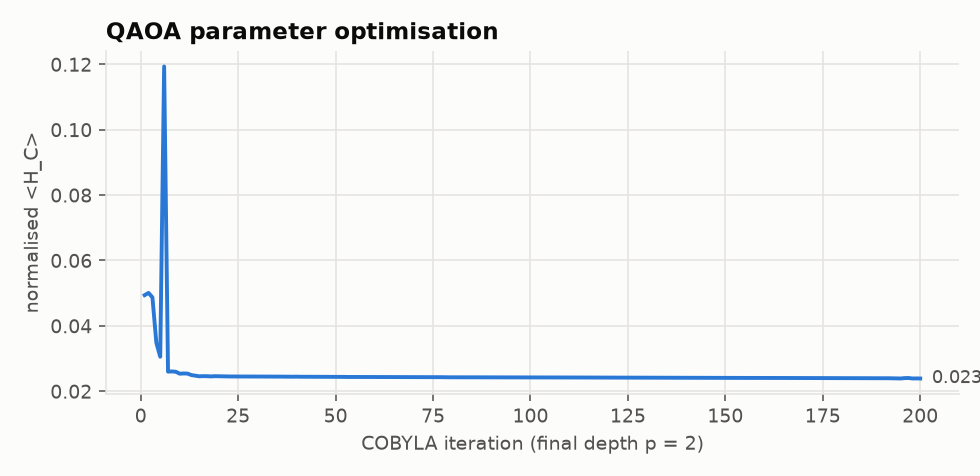
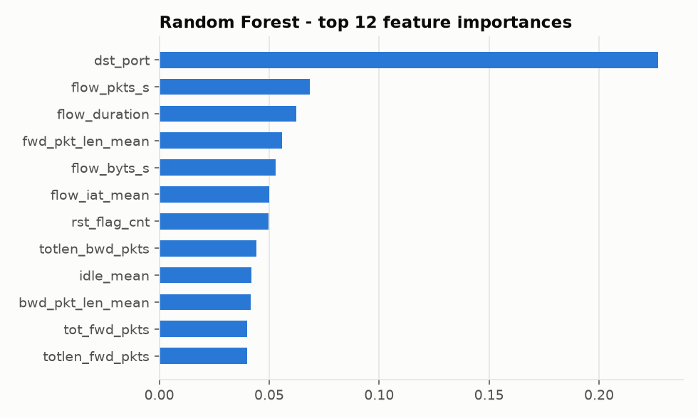

# Q-ADAPT - Results Report

Generated by `python -m experiments.make_report` on 2026-10-02. All figures and tables are produced from code in this repository with fixed seeds; experiment tables come from `results/*.json` (`python -m experiments.run_all`). QAOA results are classical simulations - no quantum speed-up is claimed.

## Contents

0. Worked example
1. ML threat detection (training, accuracy, curves)
2. Attack-graph scalability
3. QAOA vs classical optimisation
4. Noise sensitivity
5. Dynamic adaptation
6. Resource constraints
7. Ablation study
8. Conclusions

## 0. Worked example - one complete Q-ADAPT run

Command: `qadapt demo` (demo enterprise, 14 assets, QAOA p = 2, budget 0.5). Decision
time 1.4 s (QUBO build + QAOA simulation) in a cloud CPU container.

**Input - ML threat assessments**

| host | attack type | probability | confidence | source |
|---|---|---|---|---|
| WEB-01 | WEB_ATTACK | 94% | 91% | 203.0.113.7 |
| APP-01 | EXPLOIT | 91% | 90% | 10.0.2.11 |

**Quantum optimisation**

| item | value |
|---|---|
| candidate actions (qubits) | 12 |
| QUBO surrogate fidelity (Spearman vs true risk) | 0.986 |
| circuit depth (scheduled) | 89 |
| function evaluations | 800 |
| approximation ratio | 0.976 |
| P(optimal QUBO state) | 0.690% (28x uniform) |
| plan feasible | True |

**Outcome**

| metric | value |
|---|---|
| network risk | 79.5% -> 34.8% (-56.2%) |
| attack paths to critical assets (p >= 5%) | 19 -> 14 |
| cost / response time / disruption | 0.15 / 0.10 / 0.19 |




**Recommendation and explanation**

| action | why |
|---|---|
| ✅ Revoke credentials on APP-01 | EXPLOIT activity on APP-01 (p=91%)<br>Asset criticality 0.75; downstream exposure HIGH<br>Expected risk reduction alone: 32.5%<br>Removing it would worsen the plan objective by +0.3014<br>Cost MEDIUM, response time LOW, business disruption MEDIUM |
| ✅ Block malicious IP 203.0.113.7 | Expected risk reduction alone: 20.4%<br>Removing it would worsen the plan objective by +0.2237<br>Cost LOW, response time LOW, business disruption LOW |
| ✖ Isolate APP-01 | Largely redundant with revoke_credentials:APP-01<br>Adding it would worsen the objective by +0.0694 (extra risk reduction does not justify cost/time/disruption) |
| ✖ Segment app -> data boundary | Largely redundant with revoke_credentials:APP-01, block_ip:ATTACKER<br>Adding it would worsen the objective by +0.1257 (extra risk reduction does not justify cost/time/disruption)<br>Long time-to-effect; faster actions give more immediate protection |
| ✖ Segment dmz -> corp boundary | Largely redundant with revoke_credentials:APP-01, block_ip:ATTACKER<br>Adding it would worsen the objective by +0.0223 (extra risk reduction does not justify cost/time/disruption)<br>Long time-to-effect; faster actions give more immediate protection |
| ✖ Isolate DC-01 | Largely redundant with revoke_credentials:APP-01, block_ip:ATTACKER<br>Adding it would worsen the objective by +0.0400 (extra risk reduction does not justify cost/time/disruption) |

<details><summary>Raw CLI output</summary>

```
================================================================
 Q-ADAPT defense recommendation
================================================================
 solver          : qaoa_p2   (1.40s, feasible=True)
 qubits / depth  : 12 / 89   approx. ratio 0.976
 risk            : 79.5% -> 34.8%   (-56.2%)
 attack paths    : 19 -> 14
 cost/time/disr. : 0.15 / 0.10 / 0.19
----------------------------------------------------------------
 [+] Revoke credentials on APP-01
       - EXPLOIT activity on APP-01 (p=91%)
       - Asset criticality 0.75; downstream exposure HIGH
       - Expected risk reduction alone: 32.5%
       - Removing it would worsen the plan objective by +0.3014
       - Cost MEDIUM, response time LOW, business disruption MEDIUM
 [+] Block malicious IP 203.0.113.7
       - Expected risk reduction alone: 20.4%
       - Removing it would worsen the plan objective by +0.2237
       - Cost LOW, response time LOW, business disruption LOW
 [ ] Isolate APP-01
       - Largely redundant with revoke_credentials:APP-01
       - Adding it would worsen the objective by +0.0694 (extra risk reduction does not justify cost/time/disruption)
 [ ] Segment app -> data boundary
       - Largely redundant with revoke_credentials:APP-01, block_ip:ATTACKER
       - Adding it would worsen the objective by +0.1257 (extra risk reduction does not justify cost/time/disruption)
       - Long time-to-effect; faster actions give more immediate protection
 [ ] Segment dmz -> corp boundary
       - Largely redundant with revoke_credentials:APP-01, block_ip:ATTACKER
       - Adding it would worsen the objective by +0.0223 (extra risk reduction does not justify cost/time/disruption)
       - Long time-to-effect; faster actions give more immediate protection
 [ ] Isolate DC-01
       - Largely redundant with revoke_credentials:APP-01, block_ip:ATTACKER
       - Adding it would worsen the objective by +0.0400 (extra risk reduction does not justify cost/time/disruption)
```
</details>

## 1. ML threat detection - training and evaluation

> **Data notice.** These numbers come from the built-in *synthetic* CICFlowMeter-style generator
> (12,000 flows, 9 classes, stratified 75/25 split). They validate the training pipeline; they are
> **not** CSE-CIC-IDS2018 / CIC-IDS2017 results. Run `python -m experiments.experiment1_ml
> --train-csv data/raw/...` on the real datasets for publishable numbers (see `docs/DATASETS.md`).

### Scores

| model | train accuracy | test accuracy | precision (macro) | recall (macro) | F1 (macro) | ROC-AUC | FPR | FNR | train s |
|---|---|---|---|---|---|---|---|---|---|
| Random Forest | 1.0000 | 0.8887 | 0.9354 | 0.7226 | 0.7827 | 0.9709 | 0.0056 | 0.2962 | 1.85 |
| Gradient Boosting | 1.0000 | 0.9397 | 0.9359 | 0.8753 | 0.9017 | 0.9813 | 0.0195 | 0.1219 | 4.91 |
| MLP neural net | 0.9419 | 0.8887 | 0.8355 | 0.8265 | 0.8296 | 0.9537 | 0.0718 | 0.1514 | 2.19 |

Best model by macro-F1: **Gradient Boosting**.

### Learning curves (training vs 3-fold validation accuracy)


| model | final train acc. | final validation acc. | generalisation gap |
|---|---|---|---|
| Random Forest | 1.0000 | 0.8856 | +0.1144 |
| Gradient Boosting | 1.0000 | 0.9416 | +0.0584 |
| MLP neural net | 0.9222 | 0.8768 | +0.0454 |

Both tree ensembles reach 100 % training accuracy. Gradient boosting generalises best (validation
0.9416) with half the generalisation gap of Random Forest; the MLP has the smallest gap but
lower accuracy. Random Forest and the MLP are still improving at the largest training size
(more data would help); gradient boosting has plateaued.

### MLP training history


### Confusion matrix and per-class F1


Weakest class: **WEB_ATTACK** (F1 0.589). Most of its errors are
predicted as BENIGN, because web attacks look like ordinary HTTP flows in flow-level features. This
is also a known difficulty on the real CIC datasets, and payload-aware features would be needed to
fix it.

### ROC curves and feature importance




## 2. Attack-graph scalability (Experiment 2)


| target size | nodes | edges | density | build ms | propagation ms | batched propagation ms/portfolio | viable paths (k=5/target) | path analysis ms | total risk |
|---|---|---|---|---|---|---|---|---|---|
| 10 | 11 | 15 | 0.1364 | 0.8 | 0.44 | 0.007 | 6.6 | 0.8 | 0.428 |
| 25 | 26 | 61 | 0.0932 | 1.4 | 0.99 | 0.026 | 10.8 | 1.2 | 0.342 |
| 50 | 51 | 183 | 0.0717 | 2.8 | 2.03 | 0.090 | 13.0 | 2.6 | 0.362 |
| 100 | 101 | 626 | 0.0620 | 7.3 | 1.25 | 0.234 | 38.6 | 14.2 | 0.668 |
| 250 | 251 | 3442 | 0.0549 | 35.2 | 1.23 | 0.754 | 129.0 | 102.2 | 0.846 |
| 500 | 501 | 13268 | 0.0530 | 126.8 | 1.93 | 4.129 | 267.0 | 582.8 | 0.895 |


## 3. QAOA vs classical optimisation (Experiments 3 & 4)


### Solution quality

| n actions | solver | optimality gap | optimal found | feasible | runtime s |
|---|---|---|---|---|---|
| 6 | score_ranking | 0.0418 ± 0.0514 | 50% | 100% | 0.002 ± 0.000 |
| 6 | greedy | 0.0000 ± 0.0000 | 100% | 100% | 0.004 ± 0.001 |
| 6 | simulated_annealing | 0.0000 ± 0.0000 | 100% | 100% | 0.735 ± 0.053 |
| 6 | genetic | 0.0000 ± 0.0000 | 100% | 100% | 0.106 ± 0.012 |
| 6 | milp | 0.0010 ± 0.0015 | 80% | 100% | 0.013 ± 0.002 |
| 6 | random_sampling | 0.0000 ± 0.0000 | 100% | 100% | 0.001 ± 0.001 |
| 6 | qaoa_p1 | 0.0000 ± 0.0000 | 100% | 100% | 0.313 ± 0.023 |
| 6 | qaoa_p2 | 0.0000 ± 0.0000 | 100% | 100% | 0.448 ± 0.035 |
| 6 | qaoa_p3 | 0.0000 ± 0.0000 | 100% | 100% | 0.611 ± 0.031 |
| 8 | score_ranking | 0.0470 ± 0.0543 | 40% | 100% | 0.002 ± 0.000 |
| 8 | greedy | 0.0000 ± 0.0000 | 100% | 100% | 0.004 ± 0.001 |
| 8 | simulated_annealing | 0.0000 ± 0.0000 | 100% | 100% | 0.924 ± 0.081 |
| 8 | genetic | 0.0000 ± 0.0000 | 100% | 100% | 0.152 ± 0.010 |
| 8 | milp | 0.0013 ± 0.0016 | 70% | 100% | 0.014 ± 0.002 |
| 8 | random_sampling | 0.0176 ± 0.0307 | 60% | 100% | 0.004 ± 0.000 |
| 8 | qaoa_p1 | 0.0000 ± 0.0000 | 100% | 100% | 0.312 ± 0.020 |
| 8 | qaoa_p2 | 0.0000 ± 0.0000 | 100% | 100% | 0.475 ± 0.033 |
| 8 | qaoa_p3 | 0.0000 ± 0.0000 | 100% | 100% | 0.686 ± 0.047 |
| 10 | score_ranking | 0.1008 ± 0.0821 | 20% | 100% | 0.003 ± 0.001 |
| 10 | greedy | 0.0190 ± 0.0383 | 70% | 100% | 0.006 ± 0.001 |
| 10 | simulated_annealing | 0.0000 ± 0.0000 | 100% | 100% | 1.552 ± 0.161 |
| 10 | genetic | 0.0000 ± 0.0000 | 100% | 100% | 0.183 ± 0.021 |
| 10 | milp | 0.0196 ± 0.0383 | 70% | 100% | 0.017 ± 0.003 |
| 10 | random_sampling | 0.1221 ± 0.0986 | 10% | 100% | 0.006 ± 0.001 |
| 10 | qaoa_p1 | 0.0067 ± 0.0151 | 90% | 100% | 0.364 ± 0.030 |
| 10 | qaoa_p2 | 0.0051 ± 0.0116 | 90% | 100% | 0.547 ± 0.030 |
| 10 | qaoa_p3 | 0.0450 ± 0.0628 | 50% | 100% | 0.766 ± 0.027 |
| 12 | score_ranking | 0.2142 ± 0.1842 | 10% | 100% | 0.003 ± 0.000 |
| 12 | greedy | 0.0737 ± 0.1065 | 60% | 100% | 0.009 ± 0.002 |
| 12 | simulated_annealing | 0.0000 ± 0.0000 | 100% | 100% | 2.950 ± 0.406 |
| 12 | genetic | 0.0000 ± 0.0000 | 100% | 100% | 0.220 ± 0.018 |
| 12 | milp | 0.0424 ± 0.0772 | 60% | 100% | 0.023 ± 0.005 |
| 12 | random_sampling | 0.1336 ± 0.0665 | 0% | 100% | 0.010 ± 0.002 |
| 12 | qaoa_p1 | 0.1116 ± 0.1306 | 30% | 100% | 0.452 ± 0.022 |
| 12 | qaoa_p2 | 0.0543 ± 0.0994 | 60% | 100% | 0.725 ± 0.035 |
| 12 | qaoa_p3 | 0.0641 ± 0.0943 | 60% | 100% | 1.068 ± 0.039 |
| 14 | score_ranking | 0.2535 ± 0.1746 | 10% | 100% | 0.003 ± 0.000 |
| 14 | greedy | 0.0772 ± 0.1053 | 50% | 100% | 0.010 ± 0.002 |
| 14 | simulated_annealing | 0.0000 ± 0.0000 | 100% | 100% | 4.376 ± 0.707 |
| 14 | genetic | 0.0000 ± 0.0000 | 100% | 100% | 0.276 ± 0.021 |
| 14 | milp | 0.0454 ± 0.0768 | 60% | 100% | 0.031 ± 0.010 |
| 14 | random_sampling | 0.2343 ± 0.1161 | 0% | 100% | 0.013 ± 0.002 |
| 14 | qaoa_p1 | 0.1343 ± 0.1242 | 10% | 100% | 0.828 ± 0.065 |
| 14 | qaoa_p2 | 0.0447 ± 0.0753 | 50% | 100% | 1.456 ± 0.080 |
| 14 | qaoa_p3 | 0.1071 ± 0.1171 | 30% | 100% | 2.318 ± 0.097 |

### QAOA circuit and landscape metrics (Experiment 4)

| n | p | qubits | approx. ratio | P(optimal QUBO state) | amplification vs uniform | scheduled depth | function evals | QUBO surrogate Spearman |
|---|---|---|---|---|---|---|---|---|
| 6 | 1 | 6 | 0.958 ± 0.002 | 0.0791 ± 0.0057 | 5.1x | 18 | 300 | 0.998 ± 0.001 |
| 6 | 2 | 6 | 0.967 ± 0.002 | 0.1019 ± 0.0140 | 6.5x | 35 | 450 | 0.998 ± 0.001 |
| 6 | 3 | 6 | 0.974 ± 0.002 | 0.1239 ± 0.0244 | 7.9x | 52 | 600 | 0.998 ± 0.001 |
| 8 | 1 | 8 | 0.970 ± 0.002 | 0.0449 ± 0.0079 | 11.5x | 27 | 300 | 0.999 ± 0.001 |
| 8 | 2 | 8 | 0.978 ± 0.001 | 0.0606 ± 0.0133 | 15.5x | 53 | 450 | 0.999 ± 0.001 |
| 8 | 3 | 8 | 0.982 ± 0.001 | 0.0717 ± 0.0193 | 18.4x | 79 | 600 | 0.999 ± 0.001 |
| 10 | 1 | 10 | 0.965 ± 0.002 | 0.0103 ± 0.0008 | 10.6x | 36 | 300 | 0.998 ± 0.001 |
| 10 | 2 | 10 | 0.975 ± 0.002 | 0.0138 ± 0.0015 | 14.1x | 71 | 450 | 0.998 ± 0.001 |
| 10 | 3 | 10 | 0.979 ± 0.002 | 0.0153 ± 0.0022 | 15.7x | 106 | 600 | 0.998 ± 0.001 |
| 12 | 1 | 12 | 0.962 ± 0.003 | 0.0044 ± 0.0011 | 18.0x | 45 | 300 | 0.997 ± 0.001 |
| 12 | 2 | 12 | 0.973 ± 0.002 | 0.0069 ± 0.0021 | 28.4x | 89 | 450 | 0.997 ± 0.001 |
| 12 | 3 | 12 | 0.977 ± 0.002 | 0.0083 ± 0.0028 | 34.0x | 133 | 600 | 0.997 ± 0.001 |
| 14 | 1 | 14 | 0.962 ± 0.003 | 0.0022 ± 0.0006 | 35.4x | 45 | 300 | 0.997 ± 0.001 |
| 14 | 2 | 14 | 0.978 ± 0.002 | 0.0041 ± 0.0013 | 67.0x | 89 | 450 | 0.997 ± 0.001 |
| 14 | 3 | 14 | 0.982 ± 0.002 | 0.0049 ± 0.0017 | 80.2x | 133 | 600 | 0.997 ± 0.001 |

### Paired comparison (all instances, Wilcoxon signed-rank on objective)

| comparison | mean difference (neg. = QAOA better) | p-value |
|---|---|---|
| qaoa_p2 vs score_ranking | -0.06195 | 1.495e-07 |
| qaoa_p2 vs greedy | -0.00467 | 0.8441 |
| qaoa_p2 vs simulated_annealing | +0.01029 | 0.01894 |
| qaoa_p2 vs genetic | +0.01029 | 0.01894 |
| qaoa_p2 vs milp | +0.00019 | 0.4397 |
| qaoa_p2 vs random_sampling | -0.04688 | 3.642e-06 |
| qaoa_p2 vs qaoa_p1 | -0.01389 | 0.01532 |
| qaoa_p2 vs qaoa_p3 | -0.01013 | 0.2332 |

Note: results are from classical simulation of QAOA; no quantum speed-up is implied. At these sizes exhaustive search is fastest; the study measures solution quality.


## 4. Quantum noise sensitivity (Experiment 5)


| p | noise | approx. ratio | P(optimal state) | optimality gap | same plan as ideal | Jaccard vs optimum |
|---|---|---|---|---|---|---|
| 1 | ideal | 0.965 ± 0.002 | 0.0104 ± 0.0008 | 0.0000 ± 0.0000 | 100% | 1.000 ± 0.000 |
| 1 | low | 0.948 ± 0.002 | 0.0094 ± 0.0009 | 0.0258 ± 0.0346 | 60% | 0.817 ± 0.182 |
| 1 | medium | 0.898 ± 0.002 | 0.0068 ± 0.0005 | 0.0183 ± 0.0328 | 60% | 0.817 ± 0.173 |
| 1 | high | 0.815 ± 0.002 | 0.0024 ± 0.0001 | 0.0627 ± 0.0657 | 40% | 0.615 ± 0.251 |
| 2 | ideal | 0.975 ± 0.002 | 0.0138 ± 0.0015 | 0.0051 ± 0.0116 | 100% | 0.925 ± 0.170 |
| 2 | low | 0.943 ± 0.002 | 0.0117 ± 0.0012 | 0.0013 ± 0.0029 | 80% | 0.950 ± 0.113 |
| 2 | medium | 0.861 ± 0.002 | 0.0061 ± 0.0006 | 0.0433 ± 0.0634 | 40% | 0.700 ± 0.256 |
| 2 | high | 0.792 ± 0.002 | 0.0013 ± 0.0000 | 0.0661 ± 0.0801 | 30% | 0.645 ± 0.238 |
| 3 | ideal | 0.979 ± 0.002 | 0.0153 ± 0.0022 | 0.0191 ± 0.0327 | 100% | 0.800 ± 0.193 |
| 3 | low | 0.932 ± 0.002 | 0.0118 ± 0.0017 | 0.0161 ± 0.0332 | 80% | 0.900 ± 0.161 |
| 3 | medium | 0.835 ± 0.002 | 0.0045 ± 0.0006 | 0.0272 ± 0.0394 | 70% | 0.850 ± 0.182 |
| 3 | high | 0.788 ± 0.002 | 0.0010 ± 0.0000 | 0.0847 ± 0.0694 | 0% | 0.420 ± 0.122 |

Note: final plans are decoded from samples and scored on the true objective, so a feasible good plan can survive noise even when the approximation ratio drops.


## 5. Dynamic adaptation (Experiment 6)


Curves use the greedy solver for speed (QAOA gives statistically identical plans here; the table
below uses QAOA). Re-optimisation and full AQDO overlap: the learning and re-weighting components
added no measurable benefit.

### A. Scripted multi-stage attack (demo network, QAOA p = 1)

| stage | event | risk before | risk after | recommended defense |
|---|---|---|---|---|
| T1 | Attack detected on Web Server | 0.775 | 0.249 | Isolate WEB-01, Block malicious IP 203.0.113.7 |
| T2 | Attacker moved to Application Server | 0.599 | 0.246 | Revoke credentials on APP-01, Increase monitoring on APP-01, Isolate DC-01 |
| T3 | Database becomes the target | 0.376 | 0.297 | Revoke credentials on DB-01, Increase monitoring on DB-01, Increase monitoring on WEB-01 |

### B. Stochastic campaigns: static vs adaptive policies

20 seeds x 8 decision steps; solver = qaoa; true effectiveness differs from nominal for: block_ip=0.25, patch_vulnerability=0.5, increase_monitoring=0.1. Loss = criticality-weighted fraction of compromised assets (lower is better).

| environment | policy | cumulative loss | final loss | critical assets lost | actions | disruption | QAOA evals |
|---|---|---|---|---|---|---|---|
| demo (14 nodes) | none | 5.077 ± 0.468 | 0.897 ± 0.035 | 4.65 | 0.0 | 0.00 | 0 |
| demo (14 nodes) | static | 2.976 ± 0.409 | 0.589 ± 0.071 | 2.05 | 2.0 | 0.54 | 80 |
| demo (14 nodes) | reoptimize | 1.501 ± 0.164 | 0.213 ± 0.022 | 0.00 | 10.8 | 1.73 | 512 |
| demo (14 nodes) | aqdo | 1.519 ± 0.167 | 0.218 ± 0.024 | 0.00 | 11.1 | 1.92 | 498 |
| enterprise-40 | none | 0.759 ± 0.334 | 0.198 ± 0.081 | 1.60 | 0.0 | 0.00 | 0 |
| enterprise-40 | static | 0.511 ± 0.290 | 0.136 ± 0.069 | 1.10 | 2.5 | 0.31 | 80 |
| enterprise-40 | reoptimize | 0.161 ± 0.106 | 0.029 ± 0.022 | 0.10 | 12.7 | 1.66 | 572 |
| enterprise-40 | aqdo | 0.161 ± 0.106 | 0.029 ± 0.022 | 0.10 | 12.3 | 1.69 | 567 |

### Paired tests (Wilcoxon signed-rank on cumulative loss)

| environment | comparison | mean difference | p-value |
|---|---|---|---|
| demo (14 nodes) | aqdo vs static | -1.4569 | 1.907e-06 |
| demo (14 nodes) | aqdo vs reoptimize | +0.0181 | 0.2157 |
| demo (14 nodes) | reoptimize vs static | -1.4750 | 1.907e-06 |
| enterprise-40 | aqdo vs static | -0.3504 | 0.001068 |
| enterprise-40 | aqdo vs reoptimize | +0.0000 | 1 |
| enterprise-40 | reoptimize vs static | -0.3504 | 0.001068 |


## 6. Resource constraints and encodings (Experiment 7)


| scenario | solver | qubits | feasible | QUBO min feasible | optimality gap | risk reduction | optimal risk reduction |
|---|---|---|---|---|---|---|---|
| A unlimited | qaoa_p2 (unbalanced) | 10 | 100% | 100% | 0.0084 ± 0.0138 | 0.586 ± 0.157 | 0.610 ± 0.168 |
| A unlimited | qaoa_p2 (slack) | 10 | 100% | 100% | 0.0084 ± 0.0138 | 0.586 ± 0.157 | 0.610 ± 0.168 |
| A unlimited | simulated_annealing | - | 100% | - | 0.0000 ± 0.0000 | 0.610 ± 0.168 | 0.610 ± 0.168 |
| A unlimited | milp | - | 100% | - | 0.0401 ± 0.0732 | 0.598 ± 0.186 | 0.610 ± 0.168 |
| B budget | qaoa_p2 (unbalanced) | 10 | 100% | 100% | 0.0057 ± 0.0135 | 0.491 ± 0.139 | 0.502 ± 0.137 |
| B budget | qaoa_p2 (slack) | 14 | 100% | 50% | 0.0284 ± 0.0509 | 0.477 ± 0.125 | 0.502 ± 0.137 |
| B budget | simulated_annealing | - | 100% | - | 0.0000 ± 0.0000 | 0.502 ± 0.137 | 0.502 ± 0.137 |
| B budget | milp | - | 100% | - | 0.0455 ± 0.0863 | 0.449 ± 0.111 | 0.502 ± 0.137 |
| C time | qaoa_p2 (unbalanced) | 10 | 100% | 100% | 0.0000 ± 0.0000 | 0.440 ± 0.102 | 0.440 ± 0.102 |
| C time | qaoa_p2 (slack) | 14 | 100% | 62% | 0.0000 ± 0.0000 | 0.440 ± 0.102 | 0.440 ± 0.102 |
| C time | simulated_annealing | - | 100% | - | 0.0000 ± 0.0000 | 0.440 ± 0.102 | 0.440 ± 0.102 |
| C time | milp | - | 100% | - | 0.0061 ± 0.0081 | 0.420 ± 0.115 | 0.440 ± 0.102 |
| D disruption | qaoa_p2 (unbalanced) | 10 | 100% | 100% | 0.0140 ± 0.0331 | 0.374 ± 0.092 | 0.400 ± 0.084 |
| D disruption | qaoa_p2 (slack) | 14 | 100% | 75% | 0.0135 ± 0.0320 | 0.386 ± 0.074 | 0.400 ± 0.084 |
| D disruption | simulated_annealing | - | 100% | - | 0.0000 ± 0.0000 | 0.400 ± 0.084 | 0.400 ± 0.084 |
| D disruption | milp | - | 100% | - | 0.0049 ± 0.0077 | 0.402 ± 0.085 | 0.400 ± 0.084 |
| E combined | qaoa_p2 (unbalanced) | 10 | 100% | 100% | 0.0000 ± 0.0000 | 0.379 ± 0.101 | 0.379 ± 0.101 |
| E combined | simulated_annealing | - | 100% | - | 0.0000 ± 0.0000 | 0.379 ± 0.101 | 0.379 ± 0.101 |
| E combined | milp | - | 100% | - | 0.0054 ± 0.0075 | 0.363 ± 0.087 | 0.379 ± 0.101 |


## 7. Ablation study (Experiment 8)


A  ML only                     severity-only risk, alert-driven candidates, rank-by-score
B  ML + attack graph           propagation risk, alert-driven candidates, rank-by-score
C  + risk engine               propagation risk, risk/path-driven candidates, rank-by-score
D  + classical optimisation    as C, interaction-aware simulated annealing
E  + QAOA                      as C, QAOA (p = 1)
F  full Q-ADAPT                as E + AQDO adaptation (re-optimisation, learning, re-weighting)

A-E decide once (static policy); F re-optimises every step. All are evaluated in the same
ground-truth attack environments (same seeds), by realised criticality-weighted loss.


20 seeds x 8 steps per environment; budget 0.5, max 4 actions per decision.

| environment | model | cumulative loss | final loss | critical assets lost | actions | disruption |
|---|---|---|---|---|---|---|
| demo (14 nodes) | A ML only | 5.077 ± 0.468 | 0.897 ± 0.035 | 4.65 | 1.9 | 0.01 |
| demo (14 nodes) | B ML + graph | 3.193 ± 0.437 | 0.629 ± 0.069 | 2.50 | 2.6 | 0.42 |
| demo (14 nodes) | C + risk engine | 3.000 ± 0.405 | 0.555 ± 0.061 | 1.95 | 2.5 | 0.72 |
| demo (14 nodes) | D + classical opt. | 2.851 ± 0.429 | 0.574 ± 0.087 | 2.05 | 2.1 | 0.55 |
| demo (14 nodes) | E + QAOA | 2.914 ± 0.401 | 0.583 ± 0.079 | 2.00 | 2.1 | 0.60 |
| demo (14 nodes) | F full Q-ADAPT | 1.435 ± 0.160 | 0.207 ± 0.025 | 0.00 | 10.9 | 2.00 |
| enterprise-40 | A ML only | 0.758 ± 0.334 | 0.198 ± 0.081 | 1.60 | 1.3 | 0.02 |
| enterprise-40 | B ML + graph | 0.574 ± 0.317 | 0.150 ± 0.076 | 1.25 | 2.9 | 0.28 |
| enterprise-40 | C + risk engine | 0.462 ± 0.268 | 0.119 ± 0.064 | 0.90 | 3.3 | 0.71 |
| enterprise-40 | D + classical opt. | 0.511 ± 0.290 | 0.136 ± 0.069 | 1.10 | 2.5 | 0.31 |
| enterprise-40 | E + QAOA | 0.511 ± 0.290 | 0.136 ± 0.069 | 1.10 | 2.5 | 0.35 |
| enterprise-40 | F full Q-ADAPT | 0.161 ± 0.106 | 0.029 ± 0.022 | 0.10 | 12.9 | 1.75 |


### Incremental contribution (Wilcoxon signed-rank on cumulative loss)

| environment | step | mean difference (neg. = improvement) | p-value |
|---|---|---|---|
| demo (14 nodes) | B ML + graph vs A ML only | -1.8841 | 0.0002523 |
| demo (14 nodes) | C + risk engine vs B ML + graph | -0.1929 | 0.1912 |
| demo (14 nodes) | D + classical opt. vs C + risk engine | -0.1489 | 0.6402 |
| demo (14 nodes) | E + QAOA vs D + classical opt. | +0.0626 | 0.6721 |
| demo (14 nodes) | F full Q-ADAPT vs E + QAOA | -1.4786 | 1.907e-06 |
| enterprise-40 | B ML + graph vs A ML only | -0.1838 | 0.04109 |
| enterprise-40 | C + risk engine vs B ML + graph | -0.1118 | 0.07699 |
| enterprise-40 | D + classical opt. vs C + risk engine | +0.0490 | 0.2507 |
| enterprise-40 | E + QAOA vs D + classical opt. | +0.0000 | 1 |
| enterprise-40 | F full Q-ADAPT vs E + QAOA | -0.3504 | 0.001068 |


## 8. Conclusions

* **Formulation works.** The fitted QUBO surrogate tracks the propagated risk with Spearman
  0.997-0.999, and unbalanced penalisation kept the QUBO minimiser feasible in every constraint
  scenario without extra qubits.
* **QAOA is viable but not superior.** It solves 6-10-action instances (near-)optimally and clearly
  beats naive ranking and equal-budget random sampling, but simulated annealing and the genetic
  algorithm were optimal on every instance; at 12-14 qubits QAOA averages a ~5 % gap (p = 2).
* **Noise matters.** High noise lowers the approximation ratio from ~0.97 to ~0.79 and changes the
  recommended plan in most runs; deeper circuits degrade more.
* **Adaptation is the biggest lever.** Re-optimising on state change roughly halves (demo) to thirds
  (enterprise) cumulative loss vs a static plan and nearly eliminates critical-asset loss
  (p < 0.002). Effectiveness learning and re-weighting added no significant gain.
* **Graph awareness matters.** Adding the attack graph to ML-only alerting significantly reduces loss.
* **Open item:** ML numbers above are on synthetic flows - rerun Experiment 1 on the public datasets.
